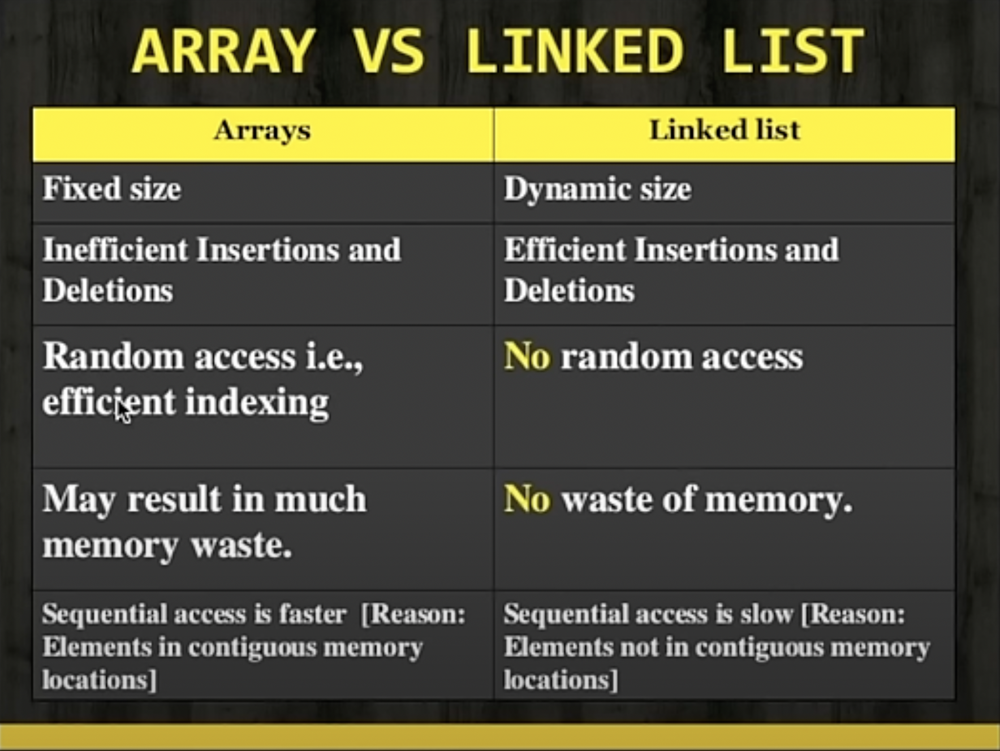

# Linked List in JavaScript

## Basic Nature

### 1. Node Class

First, let's define a `Node` class representing each element in the linked list. Each node has two properties: `data` to store the value and `next` to point to the next node in the list.

```javascript
class Node {
    constructor(data) {
        this.data = data;
        this.next = null;
    }
}
```

### 2. LinkedList Class

Next, let's create a `LinkedList` class to manage the linked list. It has a `head` property pointing to the first node in the list.

```javascript
class LinkedList {
    constructor() {
        this.head = null;
    }

    // Other methods will be added here
}
```

### 3. Append Method

Implement the `append` method to add elements to the end of the linked list. Traverse the list until you find the last node, then append the new node.

```javascript
append(data) {
    const newNode = new Node(data);
    if (!this.head) {
        this.head = newNode;
        return;
    }
    let current = this.head;
    while (current.next) {
        current = current.next;
    }
    current.next = newNode;
}
```

### 4. Prepend Method

You can add a `prepend` method to insert elements at the beginning of the linked list.

```javascript
prepend(data) {
    const newNode = new Node(data);
    newNode.next = this.head;
    this.head = newNode;
}
```

### 5. Delete Method

Implement the `delete` method to remove a node by value from the linked list.

```javascript
delete(data) {
    if (!this.head) return;
    if (this.head.data === data) {
        this.head = this.head.next;
        return;
    }
    let current = this.head;
    while (current.next) {
        if (current.next.data === data) {
            current.next = current.next.next;
            return;
        }
        current = current.next;
    }
}
```

### 6. Search Method

Implement the `search` method to find a node with a specific value in the linked list.

```javascript
search(data) {
    let current = this.head;
    while (current) {
        if (current.data === data) {
            return true;
        }
        current = current.next;
    }
    return false;
}
```

### 7. Print Method

Add a `print` method to display the elements of the linked list.

```javascript
print() {
    let current = this.head;
    while (current) {
        console.log(current.data);
        current = current.next;
    }
}
```

### Example Usage

Here's how you can use the `LinkedList` class:

```javascript
const linkedList = new LinkedList();
linkedList.append(1);
linkedList.append(2);
linkedList.prepend(0);
linkedList.delete(1);
console.log(linkedList.search(2)); // Output: true
console.log(linkedList.search(1)); // Output: false
linkedList.print(); // Output: 0 2
```

This guide should help you review the basics of linked lists in JavaScript, which are commonly asked about in interviews. Practice implementing these methods and understanding their complexities to feel more confident during your interview. Good luck!

## Advantages and disadvantages of LinkedList in Js

**=>** Let's explore the advantages and disadvantages of using linked lists in JavaScript:

### Advantages:

1. **Dynamic Memory Allocation:** Linked lists use dynamic memory allocation, allowing them to grow or shrink in size as needed. This makes them suitable for scenarios where the size of the data structure is not known in advance or changes frequently.
2. **Efficient Insertion and Deletion:** Insertion and deletion operations in linked lists are generally faster and more efficient compared to arrays, especially for operations at the beginning or middle of the list. No shifting of elements is required, resulting in constant time complexity O(1) for these operations.
3. **Flexible Data Structure:** Linked lists offer flexibility in managing data, allowing for efficient insertion, deletion, and manipulation of elements. They can easily accommodate changes to the structure of the list without the need for resizing or reallocation of memory.
4. **Dynamic Data Structures:** Linked lists can be used to implement various dynamic data structures such as stacks, queues, and hash tables. They serve as fundamental building blocks for more complex data structures and algorithms.
5. **No Contiguous Memory Requirement:** Linked lists do not require contiguous memory allocation, unlike arrays. This allows them to utilize memory more efficiently, especially in scenarios where memory fragmentation is a concern.

### Disadvantages:

1. **No Random Access:** Linked lists do not support random access to elements. Accessing an element requires traversing the list from the beginning, resulting in linear time complexity O(n) for access operations.
2. **Increased Memory Overhead:** Linked lists have a higher memory overhead compared to arrays. Each node in the linked list requires additional memory to store the reference/pointer to the next node, leading to increased memory usage, especially for large lists.
3. **Less Cache Locality:** Linked lists have poorer cache performance compared to arrays. Since nodes are scattered in memory, traversing a linked list may result in more cache misses, leading to decreased performance, especially in applications with heavy memory access patterns.
4. **Inefficient for Some Operations:** Certain operations, such as accessing elements by index or performing bulk operations like sorting, are less efficient with linked lists compared to arrays. Linked lists may not be the best choice for scenarios requiring frequent random access or complex operations.
5. **Potential for Memory Leaks:** In garbage-collected environments like JavaScript, circular references in linked lists can lead to memory leaks if not managed properly. Circular references occur when a node references another node that eventually references back to the original node, forming a loop that prevents garbage collection.
6. **Complexity in Maintenance:** Linked lists can be more complex to implement and maintain compared to arrays, especially in scenarios where insertion, deletion, or manipulation of elements require careful handling of pointers and references.

In conclusion, while linked lists offer several advantages such as dynamic memory allocation and efficient insertion/deletion operations, they also come with certain disadvantages, particularly in terms of access efficiency and memory overhead. It's essential to carefully consider these trade-offs when choosing the appropriate data structure for a given problem in JavaScript.

## Array Vs LinkedList

**=>** Certainly! Let's compare nodes and pointers, which are fundamental to linked lists, with arrays and linked lists themselves.

### 1. Representation:

- **Arrays**: In memory, elements of an array are stored in contiguous memory locations. Elements can be accessed directly using indices.
- **Linked Lists**: In linked lists, elements (nodes) are stored at scattered memory locations. Each node contains data and a pointer/reference to the next node in the sequence.

### 2. Memory Allocation:

- **Arrays**: Arrays require contiguous memory allocation. They are of fixed size and need to be resized if more elements are added than the allocated size.
- **Linked Lists**: Linked lists use dynamic memory allocation. Nodes can be added or removed without requiring contiguous memory blocks.



### 3. Insertion and Deletion:

- **Arrays**: Insertion and deletion in arrays can be expensive, especially if elements need to be shifted. Insertions and deletions at the end of the array are generally faster.
- **Linked Lists**: Insertions and deletions in linked lists are generally faster and more efficient compared to arrays, especially for inserting/deleting elements at the beginning or middle of the list. No shifting of elements is required.

### 4. Random Access:

- **Arrays**: Arrays support random access, meaning elements can be accessed directly by their index. This results in constant time complexity O(1) for access.
- **Linked Lists**: Linked lists do not support direct/random access. To access an element, you need to traverse the list from the beginning, resulting in linear time complexity O(n) for access.

### 5. Memory Overhead:

- **Arrays**: Arrays have less memory overhead as they only need to store the elements and an optional fixed-size capacity.
- **Linked Lists**: Linked lists have more memory overhead due to the additional pointers/references in each node.

### 6. Cache Performance:

- **Arrays**: Arrays often have better cache performance due to spatial locality, as elements are stored in contiguous memory locations.
- **Linked Lists**: Linked lists may have poorer cache performance due to scattered memory locations of nodes.

### Conclusion:

- Arrays are suitable for scenarios requiring random access and a fixed size.
- Linked lists are preferred for scenarios requiring frequent insertions/deletions, dynamic size, and when memory allocation is unpredictable.
- Nodes and pointers are essential components of linked lists, enabling dynamic memory allocation and efficient insertion/deletion operations.

## Types of LinkedList in Js

**=>** Let's delve into the types of linked lists you mentioned:

### 1. Singly Linked List:

In a singly linked list, each node contains data and a reference (or pointer) to the next node in the sequence. The last node points to null, indicating the end of the list.

#### Node Structure:

```javascript
class Node {
    constructor(data) {
        this.data = data;
        this.next = null;
    }
}
```

#### Singly Linked List Implementation:

```javascript
class SinglyLinkedList {
    constructor() {
        this.head = null;
    }

    // Methods like append, prepend, delete, search, print, etc. can be implemented here
}
```

### 2. Doubly Linked List:

In a doubly linked list, each node contains data, a reference to the next node, and a reference to the previous node. This allows traversal in both forward and backward directions.

#### Node Structure:

```javascript
class Node {
    constructor(data) {
        this.data = data;
        this.next = null;
        this.prev = null;
    }
}
```

#### Doubly Linked List Implementation:

```javascript
class DoublyLinkedList {
    constructor() {
        this.head = null;
        this.tail = null;
    }

    // Methods like append, prepend, delete, search, print, etc. can be implemented here
}
```

### 3. Circular Linked List:

In a circular linked list, the last node points back to the first node, forming a circular loop. This means there is no null reference to indicate the end of the list.

#### Node Structure (Similar to Singly Linked List):

```javascript
class Node {
    constructor(data) {
        this.data = data;
        this.next = null;
    }
}
```

#### Circular Linked List Implementation:

```javascript
class CircularLinkedList {
    constructor() {
        this.head = null;
    }

    // Methods like append, prepend, delete, search, print, etc. can be implemented here
}
```

### Comparison:

- **Singly Linked List**: Each node has a reference to the next node only, making traversal efficient in one direction. It is memory-efficient but does not support backward traversal.
- **Doubly Linked List**: Each node has references to both the next and previous nodes, enabling traversal in both directions. It supports efficient insertion and deletion operations but requires more memory due to the extra reference.
- **Circular Linked List**: Similar to singly linked lists, but the last node points back to the first node, forming a circular loop. This can simplify certain operations and allows continuous traversal without reaching the end of the list.

Choose the appropriate type of linked list based on the requirements of your application. Each type has its advantages and trade-offs in terms of memory usage, traversal efficiency, and supported operations.

## Important Concept For LinkedList

### What is a Pointer ?

**=>** In JavaScript, pointers are not explicitly used in the same way they are in lower-level programming languages like C or C++. However, JavaScript uses references, which are conceptually similar to pointers.

In JavaScript, objects and arrays are reference types. When you assign an object or array to a variable, you're not storing the actual object or array in the variable; instead, you're storing a reference to the memory location where the object or array is stored.

Here's an example:

```javascript
let obj1 = { name: 'Alice' };
let obj2 = obj1; // obj2 now references the same memory location as obj1

obj1.name = 'Bob';

console.log(obj2.name); // Output: Bob
```

In this example, `obj1` and `obj2` initially reference the same object. When we change the `name` property of `obj1`, it also affects `obj2`, because they both reference the same memory location.

Similarly, when dealing with linked lists, each node contains a reference to the next node in the sequence. This reference is akin to a pointer, as it points to the memory location of the next node.

Here's how you might define a simple linked list node in JavaScript:

```javascript
class Node {
    constructor(data) {
        this.data = data;
        this.next = null; // Reference to the next node
    }
}
```

So, while JavaScript doesn't use pointers in the explicit sense, it utilizes references to achieve similar functionality.

## Application of LinkedList in js

**=>** LinkedLists in JavaScript can be applied in various scenarios, including:

1. **Implementing Data Structures**: Linked lists serve as fundamental building blocks for implementing more complex data structures such as stacks, queues, and hash tables.
2. **Dynamic Memory Allocation**: Unlike arrays, linked lists allow for dynamic memory allocation, making them suitable for scenarios where the size of the data structure is not known in advance or changes frequently.
3. **Undo/Redo Functionality**: Linked lists can be used to implement undo/redo functionality in applications where users perform actions that need to be reversible. Each node in the linked list can represent an action, and traversing the list allows the application to undo or redo those actions.
4. **Navigation History**: Web browsers often use linked lists to implement navigation history. Each page visited is represented by a node, and users can navigate backward and forward through their browsing history by traversing the linked list.
5. **Music Playlists**: Linked lists can be used to implement playlists in music applications. Each node represents a song, with a reference to the next song in the playlist. Users can navigate through the playlist by traversing the linked list.
6. **Task Management**: Linked lists can be used to implement task management systems, where each node represents a task and contains information such as the task description, priority, due date, etc. Users can add, remove, and reorder tasks by manipulating the linked list.
7. **Symbol Tables**: Linked lists can be used to implement symbol tables in compilers or interpreters. Each node in the linked list represents a symbol (variable, function, etc.), and the list allows for efficient lookup, insertion, and deletion of symbols.
8. **Graph Algorithms**: Linked lists are used in graph algorithms such as breadth-first search (BFS) and depth-first search (DFS) to represent adjacency lists, where each node in the graph is represented by a linked list containing its adjacent vertices.

These are just a few examples of how linked lists can be applied in JavaScript applications. Their flexibility and efficient insertion/deletion operations make them suitable for various scenarios where dynamic data storage and manipulation are required.

## CURD operations of Singly LinkedList in js

**=>**  Basic implementations of CRUD (Create, Read, Update, Delete) operations for a singly linked list in JavaScript:

### 1. Create (Append)

To create a new node and append it to the end of the linked list.

```javascript
class Node {
    constructor(data) {
        this.data = data;
        this.next = null;
    }
}

class SinglyLinkedList {
    constructor() {
        this.head = null;
    }

    append(data) {
        const newNode = new Node(data);
        if (!this.head) {
            this.head = newNode;
            return;
        }
        let current = this.head;
        while (current.next) {
            current = current.next;
        }
        current.next = newNode;
    }
}
```

### 2. Read (Traverse / Print)

To read and print the data of all nodes in the linked list.

```javascript
class SinglyLinkedList {
    // constructor and append method here

    print() {
        let current = this.head;
        while (current) {
            console.log(current.data);
            current = current.next;
        }
    }
}
```

### 3. Update

To update the data of a specific node in the linked list.

```javascript
class SinglyLinkedList {
    // constructor, append, and print methods here

    update(oldData, newData) {
        let current = this.head;
        while (current) {
            if (current.data === oldData) {
                current.data = newData;
                return;
            }
            current = current.next;
        }
        console.log("Node with data " + oldData + " not found.");
    }
}
```

### 4. Delete

To delete a node with a specific data value from the linked list.

```javascript
class SinglyLinkedList {
    // constructor, append, print, and update methods here

    delete(data) {
        if (!this.head) {
            console.log("List is empty.");
            return;
        }
        if (this.head.data === data) {
            this.head = this.head.next;
            return;
        }
        let current = this.head;
        while (current.next) {
            if (current.next.data === data) {
                current.next = current.next.next;
                return;
            }
            current = current.next;
        }
        console.log("Node with data " + data + " not found.");
    }
}
```

These are basic implementations of CRUD operations for a singly linked list in JavaScript. You can further enhance them by adding error handling, validation, and additional functionalities as needed for your specific use case.
