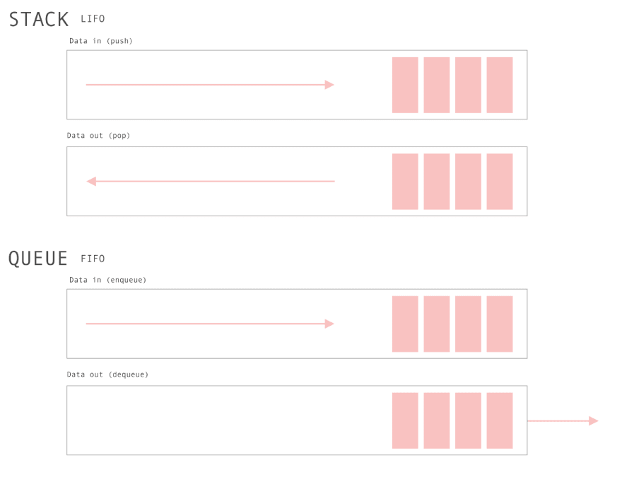

# Queue in JavaScript

**=>** In JavaScript, you can implement a queue data structure using arrays. A queue follows the First-In-First-Out (FIFO) principle, meaning that the first element added to the queue will be the first one to be removed. Here's a basic implementation of a queue:



```javascript
class Queue {
  constructor() {
    this.items = [];
  }

  // Add element to the queue
  enqueue(element) {
    this.items.push(element);
  }

  // Remove and return the first element from the queue
  dequeue() {
    if (this.isEmpty()) {
      return "Queue is empty";
    }
    return this.items.shift();
  }

  // Return the first element of the queue without removing it
  front() {
    if (this.isEmpty()) {
      return "Queue is empty";
    }
    return this.items[0];
  }

  // Check if the queue is empty
  isEmpty() {
    return this.items.length === 0;
  }

  // Return the size of the queue
  size() {
    return this.items.length;
  }

  // Print the elements of the queue
  print() {
    console.log(this.items.join(' '));
  }
}

// Example usage:
const queue = new Queue();
queue.enqueue(10);
queue.enqueue(20);
queue.enqueue(30);
queue.print(); // Output: 10 20 30
console.log(queue.dequeue()); // Output: 10
console.log(queue.front()); // Output: 20
console.log(queue.size()); // Output: 2
console.log(queue.isEmpty()); // Output: false
```

This implementation uses an array to store the elements of the queue and provides methods like `enqueue`, `dequeue`, `front`, `isEmpty`, `size`, and `print` to manipulate and interact with the queue.

# Queue Implementation in JavaScript Using Arrays

**=>** Here's a concise cheat sheet for queues in JavaScript:

```javascript
// Queue Class Implementation

class Queue {
  constructor() {
    this.items = [];
  }

  // Add element to the queue
  enqueue(element);

  // Remove and return the first element from the queue
  dequeue();

  // Return the first element of the queue without removing it
  front();

  // Check if the queue is empty
  isEmpty();

  // Return the size of the queue
  size();

  // Print the elements of the queue
  print();
}

// Usage Example:

const queue = new Queue();
queue.enqueue(element); // Add element to the queue
queue.dequeue(); // Remove and return the first element
queue.front(); // Return the first element without removing it
queue.isEmpty(); // Check if the queue is empty
queue.size(); // Get the size of the queue
queue.print(); // Print the elements of the queue
```

Remember, in a queue:

- `enqueue(element)`: Adds an element to the end of the queue.
- `dequeue()`: Removes and returns the first element from the queue.
- `front()`: Returns the first element of the queue without removing it.
- `isEmpty()`: Checks if the queue is empty.
- `size()`: Returns the size of the queue.
- `print()`: Prints the elements of the queue.

Using these methods, you can efficiently implement and manipulate queues in JavaScript. Good luck with your interview!

# Queue Implementation Using Linked List

**=>** Here's a queue implementation using a linked list in JavaScript:

```javascript
// Define a Node class to represent elements in the linked list
class Node {
  constructor(data) {
    this.data = data;
    this.next = null;
  }
}

// Define a Queue class using a linked list
class Queue {
  constructor() {
    this.front = null; // Points to the front of the queue
    this.rear = null; // Points to the rear of the queue
    this.size = 0; // Size of the queue
  }

  // Add element to the rear of the queue
  enqueue(data) {
    const newNode = new Node(data);
    if (this.isEmpty()) {
      this.front = newNode;
    } else {
      this.rear.next = newNode;
    }
    this.rear = newNode;
    this.size++;
  }

  // Remove and return the element from the front of the queue
  dequeue() {
    if (this.isEmpty()) {
      return null;
    }
    const removedNode = this.front;
    this.front = this.front.next;
    if (!this.front) {
      this.rear = null;
    }
    this.size--;
    return removedNode.data;
  }

  // Return the front element of the queue without removing it
  peek() {
    return this.isEmpty() ? null : this.front.data;
  }

  // Check if the queue is empty
  isEmpty() {
    return this.size === 0;
  }

  // Return the size of the queue
  getSize() {
    return this.size;
  }

  // Print the elements of the queue
  print() {
    let current = this.front;
    const elements = [];
    while (current) {
      elements.push(current.data);
      current = current.next;
    }
    console.log(elements.join(' '));
  }
}

// Usage Example:

const queue = new Queue();
queue.enqueue(10);
queue.enqueue(20);
queue.enqueue(30);
queue.print(); // Output: 10 20 30
console.log(queue.dequeue()); // Output: 10
console.log(queue.peek()); // Output: 20
console.log(queue.getSize()); // Output: 2
console.log(queue.isEmpty()); // Output: false
```

In this implementation:

- Each element of the queue is represented by a Node object containing the data and a reference to the next node.
- The Queue class maintains references to the front and rear of the queue, and keeps track of the size.
- Operations like `enqueue`, `dequeue`, `peek`, `isEmpty`, `getSize`, and `print` are implemented to manipulate and interact with the queue.

# Avdantages and Disadvantages of Queue In Js

**=>** Here are some advantages and disadvantages of using queues in JavaScript:

**Advantages:**

1. **FIFO Principle**: Queues follow the First-In-First-Out principle, ensuring that the first element added to the queue will be the first one to be removed. This behavior is useful in scenarios where order matters, such as processing tasks in the order they were received.
2. **Synchronization**: Queues can be used for synchronization between different parts of a program or between different threads in concurrent programming. For example, in event-driven programming, queues can help manage the flow of events.
3. **Data Management**: Queues are efficient for managing data in scenarios where elements need to be processed in a specific order. For example, in web development, queues can be used to handle asynchronous tasks like handling requests or processing data.
4. **Breadth-First Search**: Queues are often used in algorithms such as Breadth-First Search (BFS) for traversing or searching trees, graphs, or other data structures level by level.

**Disadvantages:**

1. **Performance Overhead**: In JavaScript, queues implemented using arrays may suffer from performance overhead, especially when dealing with large datasets. Operations like enqueue and dequeue may require shifting elements in the array, which can be inefficient for large queues.
2. **Memory Management**: Queues implemented using arrays may lead to memory fragmentation, especially if elements are frequently added and removed. This can result in increased memory usage and decreased performance over time.
3. **Potential Blocking**: In scenarios where queues are used for synchronization, there's a risk of potential blocking if the queue becomes full and cannot accept new elements. This can lead to deadlocks or other issues in concurrent programming.
4. **Complexity**: While queues are relatively simple data structures, managing and debugging code involving queues can become complex, especially in large-scale applications with multiple modules or components interacting with the queue.

Despite these disadvantages, queues remain a fundamental data structure in JavaScript and are widely used in various applications for their simplicity and effectiveness in managing data flow.

# ***Implement Queue using Stacks

**=>** You can implement a queue using two stacks. Here's how you can do it in JavaScript:

```javascript
class Queue {
  constructor() {
    this.stack1 = [];
    this.stack2 = [];
  }

  // Add element to the queue
  enqueue(element) {
    // Push the element onto stack1
    this.stack1.push(element);
  }

  // Remove and return the first element from the queue
  dequeue() {
    // If stack2 is empty, transfer elements from stack1 to stack2
    if (this.stack2.length === 0) {
      // Transfer all elements from stack1 to stack2
      while (this.stack1.length > 0) {
        this.stack2.push(this.stack1.pop());
      }
    }
    // Pop from stack2
    return this.stack2.pop();
  }

  // Return the first element of the queue without removing it
  front() {
    // If stack2 is empty, transfer elements from stack1 to stack2
    if (this.stack2.length === 0) {
      // Transfer all elements from stack1 to stack2
      while (this.stack1.length > 0) {
        this.stack2.push(this.stack1.pop());
      }
    }
    // Return the top element of stack2
    return this.stack2[this.stack2.length - 1];
  }

  // Check if the queue is empty
  isEmpty() {
    return this.stack1.length === 0 && this.stack2.length === 0;
  }

  // Return the size of the queue
  size() {
    return this.stack1.length + this.stack2.length;
  }
}

// Usage Example:

const queue = new Queue();
queue.enqueue(10);
queue.enqueue(20);
queue.enqueue(30);
console.log(queue.front()); // Output: 10
console.log(queue.dequeue()); // Output: 10
console.log(queue.front()); // Output: 20
console.log(queue.size()); // Output: 2
console.log(queue.isEmpty()); // Output: false
```

In this implementation:

- `stack1` is used to enqueue elements, and `stack2` is used to dequeue elements.
- When dequeue or front operation is called, if `stack2` is empty, all elements are transferred from `stack1` to `stack2`. This operation is performed only when necessary, ensuring that elements are dequeued in the correct order.
- Operations like `enqueue`, `dequeue`, `front`, `isEmpty`, and `size` are implemented to manipulate and interact with the queue.
