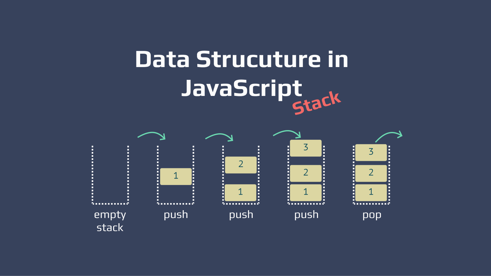

# Stack In JavaScript

**=>** In JavaScript, a stack is a data structure that follows the Last In, First Out (LIFO) principle. It's similar to a stack of plates where you can only access the top plate. In programming terms, you can only add or remove items from the top of the stack.

Here's a basic implementation of a stack in JavaScript using an array:



```javascript
class Stack {
  constructor() {
    this.items = [];
  }

  // Push element to the top of the stack
  push(element) {
    this.items.push(element);
  }

  // Pop element from the top of the stack and return it
  pop() {
    if (this.isEmpty()) {
      return "Underflow";
    }
    return this.items.pop();
  }

  // Peek at the top element of the stack without removing it
  peek() {
    return this.items[this.items.length - 1];
  }

  // Check if the stack is empty
  isEmpty() {
    return this.items.length === 0;
  }

  // Get the size of the stack
  size() {
    return this.items.length;
  }

  // Clear the stack
  clear() {
    this.items = [];
  }

  // Print the stack elements
  print() {
    console.log(this.items.toString());
  }
}

// Example usage:
const stack = new Stack();
stack.push(1);
stack.push(2);
stack.push(3);
stack.print(); // Output: 1,2,3
console.log(stack.pop()); // Output: 3
console.log(stack.peek()); // Output: 2
console.log(stack.size()); // Output: 2
stack.clear();
console.log(stack.isEmpty()); // Output: true
```

In this implementation, we use an array to store the stack elements. The `push()` method adds an element to the top of the stack, the `pop()` method removes and returns the top element, the `peek()` method returns the top element without removing it, `isEmpty()` checks if the stack is empty, `size()` returns the size of the stack, `clear()` clears the stack, and `print()` prints the elements of the stack.

# Stack implementation in JavaScript Using Arrays

**=>** Here's a concise cheat sheet for implementing a stack in JavaScript:

```javascript
// Stack implementation in JavaScript

class Stack {
  constructor() {
    this.items = [];
  }

  // Add element to the top of the stack
  push(element) {
    this.items.push(element);
  }

  // Remove and return the top element of the stack
  pop() {
    if (this.isEmpty()) {
      return "Underflow";
    }
    return this.items.pop();
  }

  // Return the top element of the stack without removing it
  peek() {
    return this.items[this.items.length - 1];
  }

  // Check if the stack is empty
  isEmpty() {
    return this.items.length === 0;
  }

  // Get the size of the stack
  size() {
    return this.items.length;
  }

  // Clear the stack
  clear() {
    this.items = [];
  }
}

// Example usage:

const stack = new Stack();
stack.push(1);
stack.push(2);
stack.push(3);

console.log(stack.pop()); // Output: 3
console.log(stack.peek()); // Output: 2
console.log(stack.size()); // Output: 2
console.log(stack.isEmpty()); // Output: false
stack.clear();
console.log(stack.isEmpty()); // Output: true
```

This cheat sheet covers the basic operations of a stack: push, pop, peek, isEmpty, size, and clear. It's concise and should be helpful for quick reference during your interview.

# Stack Implementation Using Linked List

**=>** Here's how you can implement a stack using a linked list in JavaScript:

```javascript
// Define a Node class to represent individual elements in the linked list
class Node {
  constructor(data) {
    this.data = data; // Data stored in the node
    this.next = null; // Pointer to the next node in the list
  }
}

// Define the Stack class
class Stack {
  constructor() {
    this.top = null; // Pointer to the top of the stack
    this.size = 0; // Size of the stack
  }

  // Push element to the top of the stack
  push(element) {
    const newNode = new Node(element); // Create a new node
    newNode.next = this.top; // Point the new node to the current top
    this.top = newNode; // Update the top to the new node
    this.size++; // Increase the size of the stack
  }

  // Pop element from the top of the stack and return it
  pop() {
    if (this.isEmpty()) {
      return "Underflow";
    }
    const removedNode = this.top; // Store the top node to be removed
    this.top = removedNode.next; // Update the top to the next node
    removedNode.next = null; // Remove reference to the next node
    this.size--; // Decrease the size of the stack
    return removedNode.data; // Return the data of the removed node
  }

  // Peek at the top element of the stack without removing it
  peek() {
    if (this.isEmpty()) {
      return null;
    }
    return this.top.data; // Return the data of the top node
  }

  // Check if the stack is empty
  isEmpty() {
    return this.size === 0;
  }

  // Get the size of the stack
  getSize() {
    return this.size;
  }

  // Clear the stack
  clear() {
    this.top = null;
    this.size = 0;
  }

  // Print the stack elements
  print() {
    let current = this.top;
    const stackArray = [];
    while (current) {
      stackArray.push(current.data);
      current = current.next;
    }
    console.log(stackArray.join(', '));
  }
}

// Example usage:
const stack = new Stack();
stack.push(1);
stack.push(2);
stack.push(3);
stack.print(); // Output: 3, 2, 1
console.log(stack.pop()); // Output: 3
console.log(stack.peek()); // Output: 2
console.log(stack.getSize()); // Output: 2
stack.clear();
console.log(stack.isEmpty()); // Output: true
```

In this implementation, we use a linked list to represent the stack. The `push`, `pop`, `peek`, `isEmpty`, `getSize`, `clear`, and `print` methods are implemented to perform stack operations. The `Node` class represents individual elements in the linked list, with each node containing data and a reference to the next node. The `Stack` class maintains a reference to the top of the stack and keeps track of the size.

# Avdantages and Disadvantages of Stack In Js

**=>** Here are some advantages and disadvantages of using a stack data structure in JavaScript:

**Advantages:**

1. **Simple Implementation:** Stacks are simple to implement, especially in JavaScript where arrays can be used to represent stacks.
2. **Efficient Operations:** Stack operations such as push, pop, and peek have a time complexity of O(1), making them very efficient.
3. **Memory Management:** Stacks use a fixed amount of memory and are allocated in a contiguous block, making memory management more predictable compared to other data structures.
4. **Function Call Stack:** JavaScript uses a stack data structure internally to manage function calls. Understanding stacks can help in understanding concepts like call stack, recursion, and asynchronous execution in JavaScript.
5. **Undo Mechanism:** Stacks can be used to implement undo functionality in applications where the previous states are stored in a stack and can be reverted easily.

**Disadvantages:**

1. **Limited Access:** Stacks provide access to only the topmost element. Accessing elements in the middle of the stack requires popping off elements until the desired element is reached.
2. **Fixed Size:** If implemented using arrays, stacks have a fixed size determined by the maximum size of the array. If the stack exceeds this size, it may result in stack overflow errors.
3. **Not Suitable for Random Access:** Stacks are not suitable for scenarios where random access to elements is required. Unlike arrays, you cannot directly access elements at arbitrary positions in a stack.
4. **Lack of Dynamic Memory Management:** Stacks do not dynamically resize themselves. If the size of the stack needs to be increased beyond its initial capacity, a new stack with a larger capacity needs to be created, and elements from the old stack need to be copied over.
5. **Limited Use Cases:** Stacks are suitable for a specific set of problems, such as managing function calls, implementing backtracking algorithms, expression evaluation, etc. They may not be the best choice for all scenarios.

Understanding these advantages and disadvantages can help in making informed decisions about when to use a stack data structure in JavaScript and when to explore alternative solutions.

# Implement Stack using Queues

**=>** You can implement a stack using two queues. The idea is to use one queue for maintaining the elements of the stack and another auxiliary queue for various operations. Here's how you can implement it in JavaScript:

```javascript
class Stack {
  constructor() {
    this.queue1 = [];
    this.queue2 = [];
  }

  // Push element onto the stack
  push(element) {
    // Push the new element onto queue1
    this.queue1.push(element);
  }

  // Pop element from the stack and return it
  pop() {
    if (this.isEmpty()) {
      return "Underflow";
    }
  
    // Move all elements except the last one from queue1 to queue2
    while (this.queue1.length > 1) {
      this.queue2.push(this.queue1.shift());
    }
  
    // Pop the last element from queue1 (which is the top of the stack)
    const poppedElement = this.queue1.shift();
  
    // Swap queue1 and queue2 references
    [this.queue1, this.queue2] = [this.queue2, this.queue1];
  
    return poppedElement;
  }

  // Return the top element of the stack without removing it
  peek() {
    if (this.isEmpty()) {
      return null;
    }
  
    // Move all elements from queue1 to queue2
    while (this.queue1.length > 1) {
      this.queue2.push(this.queue1.shift());
    }
  
    // Peek at the last element of queue1 (which is the top of the stack)
    const topElement = this.queue1[0];
  
    // Move the top element back to queue1
    this.queue2.push(this.queue1.shift());
  
    // Swap queue1 and queue2 references
    [this.queue1, this.queue2] = [this.queue2, this.queue1];
  
    return topElement;
  }

  // Check if the stack is empty
  isEmpty() {
    return this.queue1.length === 0;
  }

  // Get the size of the stack
  size() {
    return this.queue1.length;
  }
}

// Example usage:
const stack = new Stack();
stack.push(1);
stack.push(2);
stack.push(3);
console.log(stack.pop()); // Output: 3
console.log(stack.peek()); // Output: 2
console.log(stack.size()); // Output: 2
console.log(stack.isEmpty()); // Output: false
```

In this implementation, `queue1` is used to store elements of the stack, and `queue2` is used as an auxiliary queue for various operations. The `push` operation simply adds elements to `queue1`. For `pop` and `peek` operations, elements are moved from `queue1` to `queue2`, leaving only the last element (which corresponds to the top of the stack) in `queue1`. Then, the top element is returned for `peek` or removed and returned for `pop`. Finally, `queue1` and `queue2` references are swapped to maintain consistency for further operations.
