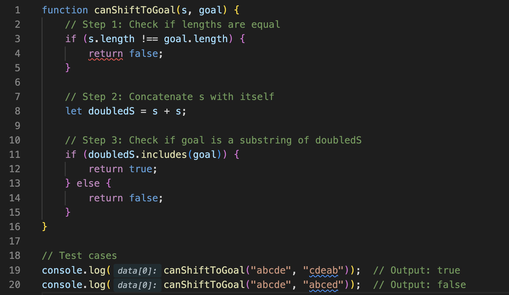
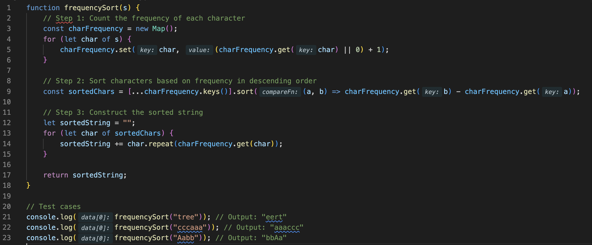
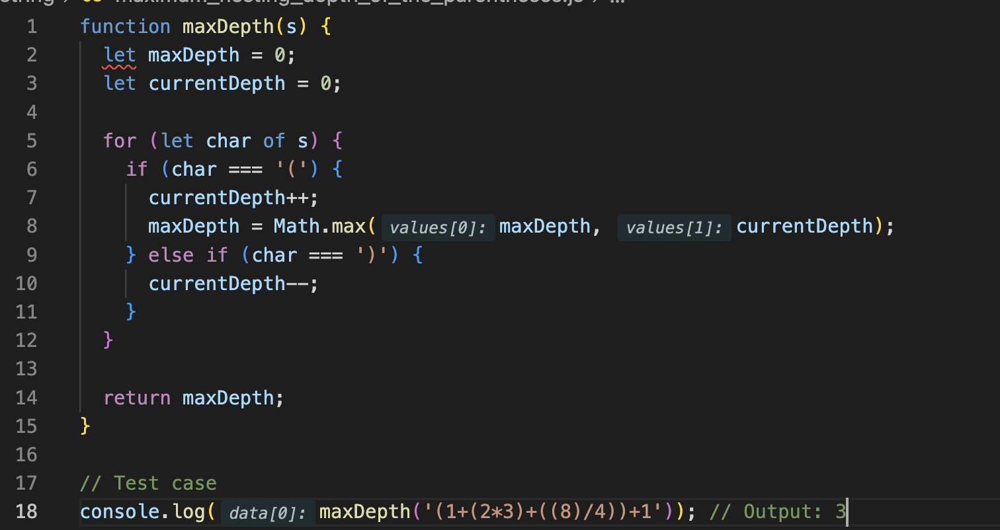
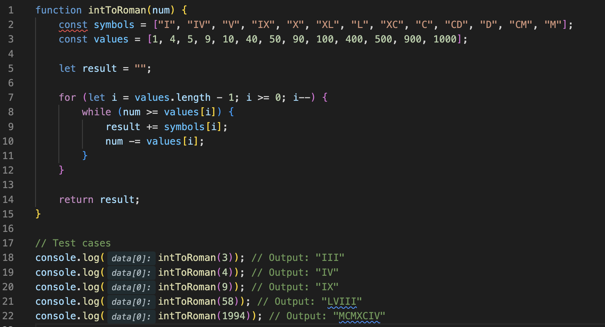
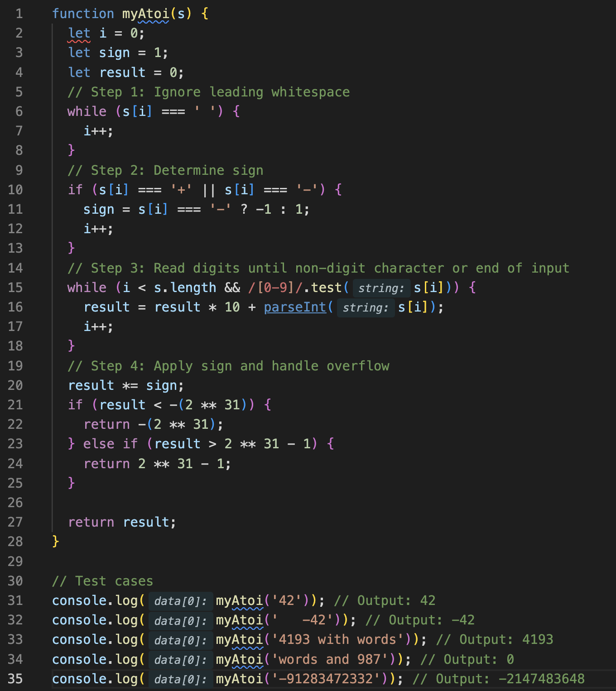
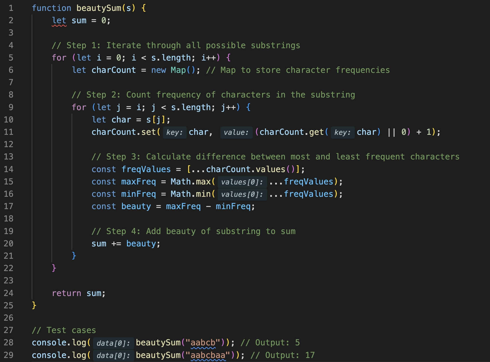
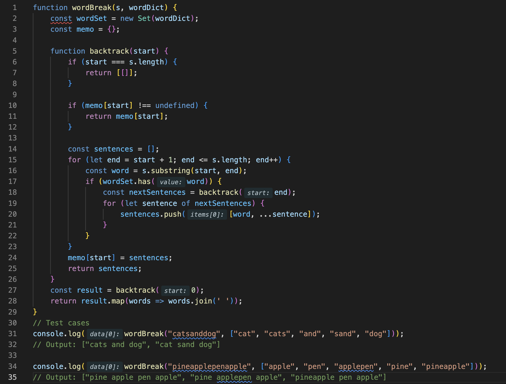

# AlgoTutor LeetCode Important Practice Questions

### 1.Reverse Words in a String (M)

Given an input string s, reverse the order of the words. A word is defined as a sequence of non-space characters.The words in s will be separated by at least one space.
Return a string of the words in reverse order concatenated by a single space. Note that s may contain leading or trailing spaces or multiple spaces between two words. The returned string should only have a single space separating the words. Do not include any extra spaces.
**Example 1:**
Input: s = "the sky is blue"
Output: "blue is sky the"

You can solve this problem by splitting the input string into an array of words, reversing the array, and then joining the words back into a string. Here's how you can implement this in JavaScript:

In this implementation:

* We first trim the input string to remove any leading or trailing spaces using the `trim()` method.
* Then, we split the trimmed string into an array of words using the `split(/\s+/)` method, which splits the string at one or more consecutive spaces.
* Next, we reverse the array of words using the `reverse()` method.
* Finally, we join the reversed array of words back into a string using the `join(' ')` method, with a single space as the separator.

This approach correctly handles cases with leading or trailing spaces and multiple spaces between words, and it returns the desired output.

### 2.Longest Palindromic Substring (M)

Given a string s, return the longest palindromic substring in s.
**Example 1:**
Input: s = "babad"
Output: "bab"
Explanation: "aba" is also a valid answer.
**Example 2:**
Input: s = "cbbd"
Output: "bb"

**=>** You can solve this problem using dynamic programming. The idea is to iterate through the string and expand around each character to find the longest palindrome centered at that character. Here's how you can implement this approach in JavaScript:

In this implementation:

* We initialize `start` and `maxLength` to keep track of the start index and length of the longest palindrome found so far.
* We define a helper function `expandAroundCenter()` to expand around a center (either a single character or the gap between characters) and update `start` and `maxLength` if a longer palindrome is found.
* We iterate through the string and expand around each character to find the longest palindrome centered at that character.
* We return the substring of `s` that corresponds to the longest palindrome found.

This algorithm has a time complexity of O(n^2), where n is the length of the input string, as we iterate through the string and expand around each character.

### 3. Longest Common Prefix (E)

Write a function to find the longest common prefix string amongst an array of strings.
If there is no common prefix, return an empty string "".
**Example 1:**
Input: strs = ["flower","flow","flight"]
Output: "fl"
**Example 2:**
Input: strs = ["dog","racecar","car"]
Output: ""
Explanation: There is no common prefix among the input
strings.

**=>** You can solve this problem by comparing characters of all strings in the array one by one. Here's how you can implement this in JavaScript:

In this implementation:

* We start by assuming that the first string in the array is the longest common prefix.
* We iterate through the characters of the first string and compare each character with the corresponding characters in the other strings.
* If any character doesn't match or if we reach the end of any string, we return the substring up to the current index as the longest common prefix.
* If all characters match for all strings, or if one string is a prefix of others, we return the first string in the array as the longest common prefix.
* If the array is empty, we return an empty string.

This algorithm has a time complexity of O(n*m), where n is the length of the array and m is the length of the longest string in the array.

### 4. Repeated String Match (M)

Given two strings a and b, return the minimum number of times you should repeat string a so that string b is a substring of it. If it is impossible for b to be a substring of a after repeating it, return -1.
Notice: string "abc" repeated 0 times is "", repeated 1 time is "abc" and repeated 2 times is "abcabc".
**Example 1:**
Input: a = "abcd"
, b = "cdabcdab"
Output: 3
Explanation: We return 3 because by repeating a three times "abcdabcdabcd" , b is a substring of it.
**Example 2:**
Input: a = "a"
, b = "aa"
Output: 2

**=>** You can solve this problem by repeatedly concatenating string `a` until it becomes long enough to contain string `b`. Then, you can check if string `b` is a substring of the concatenated string. If it is, return the number of times `a` was repeated; otherwise, return -1. Here's how you can implement this in JavaScript:

In this implementation:

* We initialize `repeated` to 1 and `concatenated` to string `a`.
* We repeatedly concatenate `a` to `concatenated` until its length is greater than or equal to the length of string `b`.
* We then check if string `b` is a substring of the concatenated string. If it is, we return the number of times `a` was repeated. If not, we check if adding one more repetition of `a` to `concatenated` makes string `b` a substring. If it does, we return `repeated + 1`. Otherwise, we return -1.
* This approach ensures that we find the minimum number of times `a` needs to be repeated to contain string `b`, or determine if it's impossible for `b` to be a substring of `a` after any number of repetitions.

This algorithm has a time complexity of O(n*m), where n is the length of string `a` and m is the length of string `b`.

### 5. Valid Anagram (E)

Given two strings s and t, return true if t is an anagram of s, and false otherwise. An Anagram is a word or phrase formed by rearranging the letters of a different word or phrase, typically using all the original letters exactly once.
**Example 1:**
Input: s = "anagram", t = "nagaram"
Output: true
**Example 2:**
Input: s = "rat", t = "car"
Output: false

**=>** You can solve this problem by counting the frequency of each character in both strings and comparing the counts. If the counts of all characters are the same in both strings, then `t` is an anagram of `s`. Here's how you can implement this in JavaScript:

In this implementation:

* We first check if the lengths of the strings `s` and `t` are equal. If they are not, they cannot be anagrams, so we return `false`.
* We use an object `charCount` to store the frequency of characters in string `s`.
* We iterate through string `s` and count the frequency of each character.
* Then, we iterate through string `t` and decrement the frequency of each character in the `charCount` object. If a character in `t` is not present in `charCount` or its count is already zero, `t` cannot be an anagram of `s`, so we return `false`.
* Finally, we check if all character counts in `charCount` are zero. If they are, `t` is an anagram of `s`, so we return `true`.

This approach has a time complexity of O(n), where n is the length of the input strings.

### 6. Valid Palindrome II (E)

Given a string s, return true if the s can be palindrome after deleting at most one character from it.
**Example 1:**
Input: s = "aba"
Output: true

**=>** You can solve this problem by using two pointers to iterate over the string `s` from both ends towards the middle. Whenever you encounter characters that do not match, you can try skipping one of them and check if the resulting substring is a palindrome. If it is, return `true`; otherwise, return `false`. Here's how you can implement this in JavaScript:

In this implementation:

* We use two pointers, `left` and `right`, initially pointing to the start and end of the string `s`, respectively.
* We define a helper function `isPalindrome` to check if a substring of `s` is a palindrome.
* While `left` is less than `right`, we iterate through the string and compare characters at positions `left` and `right`. If they don't match, we try skipping either the character at `left` or `right` and check if the resulting substring is a palindrome using the `isPalindrome` function.
* If we find a mismatch and neither of the substrings formed by skipping one character is a palindrome, we return `false`.
* If we reach the end of the loop without finding any mismatches, the string is already a palindrome or can be made a palindrome by removing at most one character, so we return `true`.

This approach has a time complexity of O(n), where n is the length of the input string `s`.

### 7. Integer to English Words (H)

Convert a non-negative integer num to its English words representation.
**Example 1:**
Input: num = 123
Output: "One Hundred Twenty Three"

**=>** To convert a non-negative integer into its English words representation, you can break down the number into groups of three digits and convert each group separately. Here's how you can implement this in JavaScript:

In this implementation:

* We define arrays `belowTwenty`, `tens`, and `thousands` to represent the English words for numbers below twenty, tens, and thousands, respectively.
* We define a helper function `helper` to convert a three-digit number into words.
* We use a while loop to iterate through groups of three digits in the number.
* Inside the loop, we convert each group of three digits to words using the `helper` function and append the appropriate thousand unit (`Thousand`, `Million`, `Billion`).
* We trim the result and return it.

This approach has a time complexity of O(n), where n is the number of digits in the input number `num`.

### 8.Group Anagrams (M)

Given an array of strings strs, group the anagrams together. You can return the answer in any order. An Anagram is a word or phrase formed by rearranging the letters of a different word or phrase, typically using all the original letters exactly once.
**Example 1:**
Input: strs = ["eat","tea","tan","ate","nat","bat"]
Output: [["bat"],["nat","tan"],["ate","eat","tea"]]
**Example 2:**
Input: strs = [""]
Output: [[""]]
Example 3:
Input: strs = ["a"]
Output: [["a"]]

**=>** You can solve this problem by grouping strings that are anagrams of each other using a hashmap where the keys are sorted versions of the strings and the values are arrays of strings that are anagrams of each other. Here's how you can implement this in JavaScript:

In this implementation:

* We use a hashmap (`anagramsMap`) to group anagrams, where the keys are sorted versions of the strings and the values are arrays of strings that are anagrams of each other.
* We iterate through each string in the input array (`strs`).
* For each string, we sort its characters to form a key for the hashmap.
* If the key doesn't exist in the hashmap, we create a new array for it.
* We then add the string to the array corresponding to its sorted key in the hashmap.
* Finally, we convert the values of the hashmap to an array and return it.

This approach has a time complexity of O(n * m * log m), where n is the length of the input array `strs` and m is the maximum length of a string in `strs`. Sorting each string takes O(m * log m) time, and we do this for each string in the array.

### 9. Basic Calculator II (M)

Given a string s which represents an expression, evaluate this expression and return its value. The integer division should truncate toward zero. You may assume that the given expression is always valid. All intermediate results will be in the range of [-231, 231 - 1].
**Note: You are not allowed to use any built-in function which evaluates strings as mathematical expressions, such as eval( ).**
**Example 1:**
Input: s = "3+2*2"
Output: 7
**Example 2:**
Input: s = " 3/2 "
Output: 1

**=>** To evaluate the given expression string, you can use the approach of converting the expression into Reverse Polish Notation (RPN) and then evaluating the RPN expression using a stack. Here's how you can implement this approach in JavaScript:

In this implementation:

* We first define a function `toRPN()` to convert the infix expression to postfix (RPN) notation. It uses the shunting-yard algorithm to convert the expression.
* We define a function `evalRPN()` to evaluate the RPN expression using a stack.
* We tokenize the input string into numbers and operators, convert the infix expression to RPN, and then evaluate the RPN expression to get the result.

This approach has a time complexity of O(n), where n is the length of the input expression `s`.

### 10.Text Justification (H)

Given an array of strings words and a width maxWidth, format the text such that each line has exactly maxWidth characters and is fully (left and right) justified.
You should pack your words in a greedy approach; that is, pack as many words as you can in each line. Pad extra spaces ' ' when necessary so that each line has exactly maxWidth characters. Extra spaces between words should be distributed as evenly as possible. If the number of spaces on a line does not divide evenly between words, the empty slots on the left will be assigned more spaces than the slots on the right. For the last line of text, it should be left-justified, and no extra space is inserted between words.

**=>** You can implement this by simulating the process of formatting the text line by line. Here's a possible implementation in JavaScript:

In this implementation:

* We iterate through each word in the input array `words`.
* For each word, we check if adding it to the current line will exceed `maxWidth`. If it does, we justify the current line and start a new line.
* We justify each line using the `justifyLine` function, which evenly distributes spaces between words. The last line is left-justified using the `justifyLastLine` function.
* Finally, we return the formatted text as an array of strings.

This approach has a time complexity of O(n), where n is the number of words in the input array `words`.

### 11.Remove Outermost Parentheses (E)

A valid parentheses string is either empty "","(" + A + ")", or A + B, where A and B are valid parentheses strings, and + represents string concatenation.
For example,
"","()","(())()", and "(()(()))" are all valid parentheses strings.
A valid parentheses string s is primitive if it is nonempty, and there does not exist a way to split it into s = A + B, with A and B nonempty valid parentheses strings. Given a valid parentheses string s, consider its primitive decomposition: s = P1 + P2 + ... + Pk, where Pi are primitive valid parentheses strings. Return s after removing the outermost parentheses of every primitive string in the primitive decomposition of s.
**Example 1:**
Input: s = "(()())(())"
Output: "()()()"

**=>** You can solve this problem by iterating through the string and counting the balance of parentheses. When the balance becomes zero, you've found a primitive substring. You can then remove the outermost parentheses of that substring. Here's how you can implement this in JavaScript:

In this implementation:

* We iterate through each character of the string `s`.
* We maintain a balance variable to count the balance of parentheses. When the balance becomes zero, we've found a primitive substring.
* We remove the outermost parentheses of each primitive substring and append the result to the `result` string.
* We return the `result` string, which contains the desired output.

This approach has a time complexity of O(n), where n is the length of the input string `s`.

### 12. Largest Odd Number in String (E)

You are given a string num, representing a large integer. Return the largest-valued odd integer (as a string) that is a non-empty substring of num, or an empty string "" if no odd integer exists. A substring is a contiguous sequence of characters within a string.
**Example 1:**
Input: num = "52"
Output: "5"
Explanation: The only non-empty substrings are "5","2", and "52". "5" is the only odd number.
**Example 2:**
Input: num = "4206"
Output: ""
Explanation: There are no odd numbers in "4206".

**=>** You can solve this problem by iterating through each digit of the string `num` from left to right. For each digit, check if it's odd. If it is, return the substring starting from that digit. Here's how you can implement this in JavaScript:

In this implementation:

* We iterate through each character of the string `num`.
* For each character, we convert it to an integer and check if it's odd. If it is, we return the substring starting from that character.
* If no odd integer is found, we return an empty string.

This approach has a time complexity of O(n), where n is the length of the input string `num`.

### 13. Isomorphic Strings (E)

Given two strings s and t, determine if they are isomorphic. Two strings s and t are isomorphic if the characters in s can be replaced to get t. All occurrences of a character must be replaced with another character while preserving the order of characters. No two characters may map to the same character, but a character may map to itself.
**Example 1:**
Input: s = "egg", t = "add"
Output: true
**Example 2:**
Input: s = "foo", t = "bar"
Output: false

**=>** You can solve this problem by using a hashmap to map characters from string `s` to characters from string `t`, and vice versa. Here's how you can implement this in JavaScript:

In this implementation:

* We iterate through each character of strings `s` and `t`.
* We use two hashmaps, `mapStoT` to map characters from `s` to `t`, and `mapTtoS` to map characters from `t` to `s`.
* For each character pair `(charS, charT)` encountered:
  * If `charS` is not yet mapped, we map it to `charT` in `mapStoT`.
  * If `charT` is not yet mapped, we map it to `charS` in `mapTtoS`.
  * If `charS` or `charT` is already mapped, we check if the existing mapping is consistent with the current character pair. If not, we return `false`.
* If no inconsistencies are found, we return `true`, indicating that `s` and `t` are isomorphic.

This approach has a time complexity of O(n), where n is the length of the input strings `s` and `t`.

### 14.Rotate String (E-796)

Given two strings s and goal, return true if and only if scan become goal after some number of shifts on s. A shift on s consists of moving the leftmost character of s to the rightmost position.
For example, if s = "abcde", then it will be "bcdea" after one shift.
**Example 1:**
Input: s = "abcde"
, goal = "cdeab"
Output: true
**Example 2:**
Input: s = "abcde"
, goal = "abced"
Output: false

**=>** To solve this problem, we can check if the string `goal` is a substring of the concatenated string `s + s`. If it is, then it's possible to obtain `goal` by performing some number of shifts on `s`. Here's how you can implement this in JavaScript:

In this implementation:

* We first check if the lengths of `s` and `goal` are equal. If they're not, it's impossible to make them equal by shifting.
* We concatenate `s` with itself to create a string `concatenatedS` that contains all possible shifts of `s`.
* We check if `goal` is a substring of `concatenatedS`. If it is, then it's possible to obtain `goal` by performing some number of shifts on `s`, so we return `true`. Otherwise, we return `false`.

This approach has a time complexity of O(n), where n is the length of the input strings `s` and `goal`. This complexity arises from the `includes()` function, which has a linear time complexity in the length of the string it's searching.

### 15. Sort Characters By Frequency (M-451)

Given a string s, sort it in decreasing order based on the frequency of the characters. The frequency of a character is the number of times it appears in the string. Return the sorted string. If there are multiple answers, return any of them.
**Example 1:**
Input: s = "tree"
Output: "eert"
**Example 2:**
Input: s = "cccaaa"
Output: "aaaccc"
**Example 3:**
Input: s = "Aabb"
Output: "bbAa"

**=>** To solve this problem, we can follow these steps:

1. Create a hashmap to count the frequency of each character in the string.
2. Sort the characters based on their frequency in descending order.
3. Construct the sorted string using the sorted characters and their frequencies.

Here's how you can implement this in JavaScript:

In this implementation:

* We first count the frequency of each character in the string `s` using a hashmap.
* We then sort the characters based on their frequency in descending order.
* Finally, we construct the sorted string by appending each character to the string according to its frequency.

**=>** This approach has a time complexity of O(n log n), where n is the length of the input string `s`. This complexity arises from sorting the characters based on their frequency. The overall time complexity is dominated by the sorting step.

### 16.Maximum Nesting Depth of the Parentheses (E-1614)

A string is a valid parentheses string (denoted VPS) if it meets one of the following: It is an empty string "" , or a single character not equal to "(" or ")" ,
  It can be written as AB (A concatenated with B), where A and B are VPS's, or

   It can be written as (A), where A is a VPS.
We can similarly define the nesting depth depth(S) of any VPS S as follows:
depth("") = 0
depth(C) = 0, where C is a string with a single
character not equal to "(" or ")".
depth(A + B) = max(depth(A), depth(B)), where A and B
are VPS's.
depth("(" + A + ")") = 1 + depth(A), where A is a VPS.
Example 1:
Input: s = "(1+(2*3)+((8)/4))+1"
Output: 3

**=>** To solve this problem, we need to count the maximum nesting depth of parentheses in the given string `s`. We can achieve this by iterating through each character of the string and keeping track of the current depth while encountering opening and closing parentheses.

Here's how you can implement this in JavaScript:

In this implementation:

* We initialize `maxDepth` and `currentDepth` variables to keep track of the maximum nesting depth encountered and the current nesting depth, respectively.
* We iterate through each character of the string `s`.
* When encountering an opening parenthesis `'('`, we increment `currentDepth` and update `maxDepth` if necessary.
* When encountering a closing parenthesis `')'`, we decrement `currentDepth`.
* Finally, we return the `maxDepth`, which represents the maximum nesting depth of parentheses in the given string.

**=>** This approach has a time complexity of O(n), where n is the length of the input string `s`, because we iterate through the string once to compute the maximum nesting depth.

### 17.Roman to Integer (E-13)

Roman numerals are represented by seven different
symbols: I, V, X, L, C, D and M.
Symbol Value
I 1
V 5
X 10
L 50
C 100
D 500
M 1000
For example, 2 is written as II in Roman numeral, just two
ones added together. 12 is written as XII, which is simply X

+ II. The number 27 is written as XXVII, which is XX + V + II.

  **=>** To convert an integer to a Roman numeral, we can follow the following steps:

  1. Create two arrays, one to store the Roman numeral symbols and the other to store their corresponding values.
  2. Iterate through the arrays in reverse order and keep adding the corresponding Roman numeral symbols to a result string until the input number is reduced to zero.

  Here's how you can implement this in JavaScript:

  

  In this implementation:

* We define two arrays, `symbols` and `values`, to store the Roman numeral symbols and their corresponding values.
* We iterate through the `values` array in reverse order.
* For each value, we repeatedly append the corresponding symbol to the `result` string until the input number is reduced to zero.
* Finally, we return the `result` string containing the Roman numeral representation of the input number.

**=>** This approach has a time complexity of O(1) because the number of iterations in the loop is fixed. The loop iterates at most 13 times, which is the number of Roman numeral symbols used to represent numbers.

### 18.String to Integer (atoi) (M-8)

Implement the myAtoi(string s) function, which converts a string to a 32-bit signed integer (similar to C/C++'s atoi function).
The algorithm for myAtoi(string s) is as follows:
1.Read in and ignore any leading whitespace.
2.Check if the next character (if not already at the end of the string) is '-' or '+'. Read this character in if it is either. This determines if the final result is negative or positive respectively. Assume the result is positive if neither is present.
3.Read in next the characters until the next non-digit character or the end of the input is reached. The rest of the string is ignored.
4. Convert these digits into an integer (i.e. "123" -> 123, "0032" -> 32). If no digits were read, then the integer is 0. Change the sign as necessary (from step 2).
**Example 1:**
Input: s = "42"
Output: 42

=> You can implement the `myAtoi` function in JavaScript following the algorithm provided. Here's the implementation:

In this implementation:

* We use a loop to skip leading whitespace.
* We determine the sign of the number and skip over the sign character if present.
* We iterate through the string, converting digits to numbers until a non-digit character is encountered.
* We apply the sign to the result and handle overflow by returning the minimum or maximum 32-bit signed integer if the result exceeds the range.

This implementation follows the given algorithm and handles edge cases such as leading whitespace, signs, and overflow.

### 19.Sum of Beauty of All Substrings (M-1781)

The beauty of a string is the difference in frequencies between the most frequent and least frequent characters.
For example, the beauty of "abaacc" is 3 - 1 = 2.
Given a string s, return the sum of beauty of all of its substrings.
**Example 1:**
Input: s = "aabcb"
Output: 5
**Example 2:**
Input: s = "aabcbaa"
Output: 17

=> To find the sum of the beauty of all substrings of a given string `s`, we can follow the following steps:

1. Iterate through all possible substrings of `s`.
2. For each substring, count the frequency of each character.
3. Calculate the difference between the frequency of the most frequent character and the frequency of the least frequent character.
4. Add this difference to the sum.

Here's how you can implement this in JavaScript:

In this implementation:

* We use two nested loops to iterate through all possible substrings of the input string `s`.
* For each substring, we count the frequency of each character using a `Map`.
* We then calculate the difference between the frequency of the most frequent character and the frequency of the least frequent character.
* Finally, we add this difference to the sum.

This approach has a time complexity of O(n^3), where n is the length of the input string `s`. This complexity arises from the nested loops used to iterate through all possible substrings.

### 20.Word Break II (H-140)

Given a string s and a dictionary of strings wordDict, add spaces in s to construct a sentence where each word is a valid dictionary word. Return all such possible sentences in any order.
Note that the same word in the dictionary may be reused multiple times in the segmentation.
**Example 1:**
Input: s = "catsanddog" , wordDict =["cat","cats","and","sand","dog"]
Output: ["cats and dog","cat sand dog"]
**Example 2:**
Input: s = "pineapplepenapple", wordDict =["apple","pen","applepen","pine","pineapple"]
Output: ["pine apple pen apple","pineapple pen apple","pine applepen apple"]

**=>** To solve this problem, we can use dynamic programming with memoization to find all possible sentences. We'll iterate through each character in the input string `s` and check if the substring from the current index to the end can form valid words from the word dictionary. We'll recursively check all possible word combinations and memoize the results to avoid redundant calculations.

Here's how you can implement this in JavaScript:

In this implementation:

* We use a recursive function `backtrack` to iterate through each character in the input string `s` and check if substrings starting from the current index can form valid words from the word dictionary.
* We memoize the results using the `memo` object to avoid redundant calculations.
* We return all possible sentences formed from valid word combinations.

This approach has a time complexity of O(n * 2^n), where n is the length of the input string `s`. The recursive function explores all possible word combinations, and the memoization helps avoid redundant calculations.
