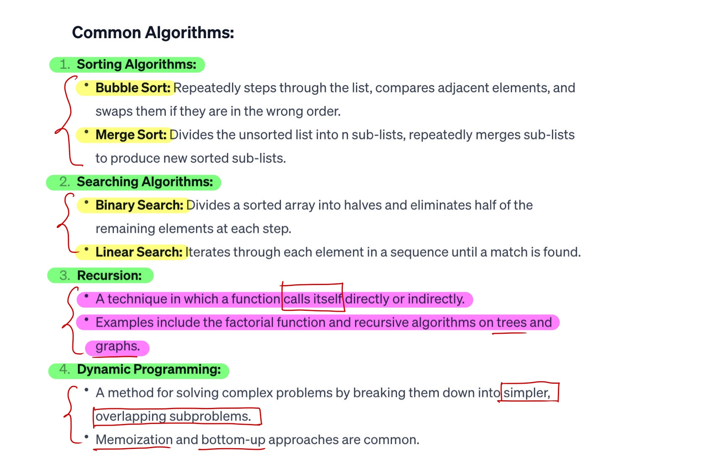

# Common Algorithms

## 1.Sorting Algorithms

### 1.1.1 Bubble Sort

**=>** Bubble sort is a simple sorting algorithm that repeatedly steps through the list, compares adjacent elements, and swaps them if they are in the wrong order. The pass through the list is repeated until the list is sorted. It is called bubble sort because smaller elements gradually "bubble" their way to the top of the list.

Here's how bubble sort works in JavaScript:

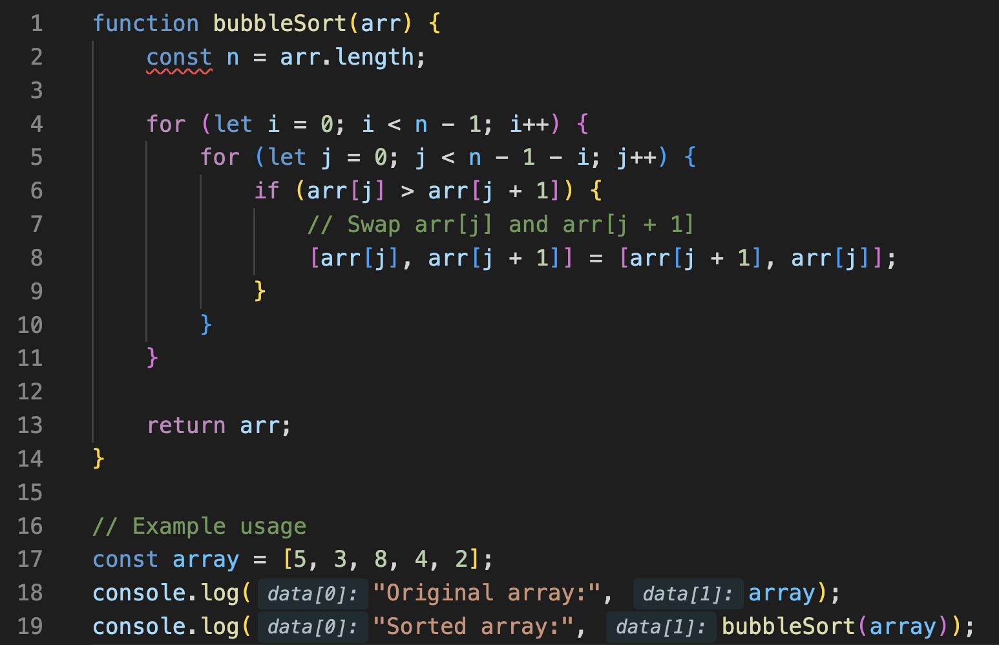

In this implementation:

* We start with an outer loop that runs from `i = 0` to `n - 1`, where `n` is the length of the array.
* Inside the outer loop, we have an inner loop that runs from `j = 0` to `n - 1 - i`. This is because after each iteration of the outer loop, the largest element will be bubbled to its correct position at the end of the array, so we don't need to compare it again.
* Inside the inner loop, we compare adjacent elements `arr[j]` and `arr[j + 1]`. If `arr[j]` is greater than `arr[j + 1]`, we swap them.
* We repeat this process until the entire array is sorted.

**Time Complexity:**

* In the worst-case scenario, where the array is in reverse order, bubble sort will perform **O**(**n**2) comparisons and swaps, where **n** is the number of elements in the array.
* In the best-case scenario, where the array is already sorted, bubble sort will perform **O**(**n**) comparisons and **O**(**1**) swaps.
* On average, bubble sort performs **O**(**n**2) comparisons and swaps.

**Space Complexity:**

* Bubble sort has a space complexity of **O**(**1**) because it only requires a constant amount of additional space for storing temporary variables.

Bubble sort is not efficient for large datasets due to its quadratic time complexity. However, it is easy to understand and implement, making it useful for educational purposes or for sorting small datasets where performance is not critical.

### 1.1.2 Sort Colors

Given an array nums with n objects colored red, white, or blue,
sort them in-place so that objects of the same color are
adjacent, with the colors in the order red, white, and blue.
We will use the integers 0, 1, and 2 to represent the color red,
white, and blue, respectively.
You must solve this problem without using the library's sort
function.
Input: nums = [2,0,2,1,1,0]
Output: [0,0,1,1,2,2]

**=>** To solve this problem, you can use the **Dutch National Flag algorithm**, also known as the **three-way partitioning algorithm**. This algorithm sorts an array of objects with three distinct keys. In this case, the keys are the colors red (0), white (1), and blue (2).

Here's how the algorithm works:

1. Initialize three pointers: `low`, `mid`, and `high`. The `low` pointer points to the start of the array, the `mid` pointer points to the current element being processed, and the `high` pointer points to the end of the array.
2. Iterate through the array while the `mid` pointer is less than or equal to the `high` pointer:
   * If the current element is 0, swap it with the element at the `low` index and increment both the `low` and `mid` pointers.
   * If the current element is 1, just increment the `mid` pointer.
   * If the current element is 2, swap it with the element at the `high` index and decrement the `high` pointer. Do not increment the `mid` pointer because the swapped element needs to be re-examined.
3. Continue this process until the `mid` pointer crosses the `high` pointer.

By following this algorithm, you can partition the array into three sections: all 0s on the left, all 1s in the middle, and all 2s on the right.

Here's the implementation of the algorithm:

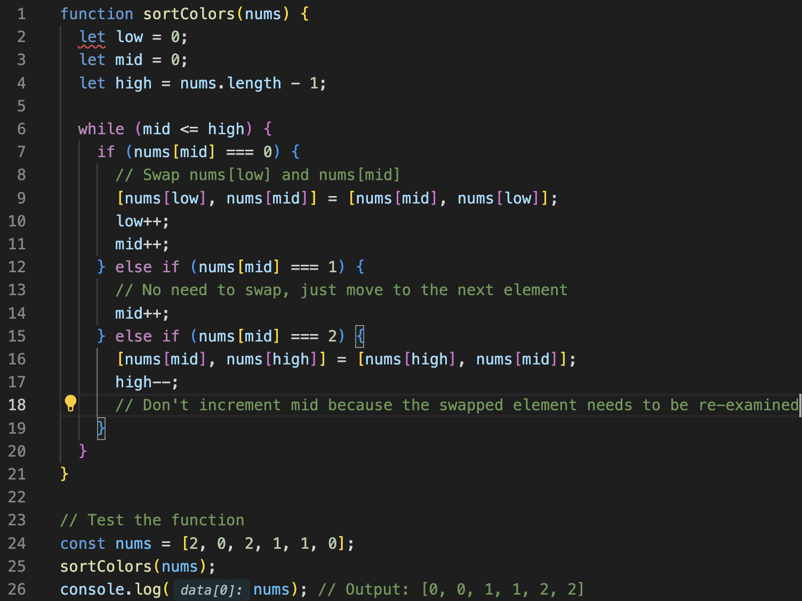

**=>** This algorithm has a time complexity of O(n), where n is the number of elements in the array. It performs a single pass through the array.

### *****BigO cheetSheet**

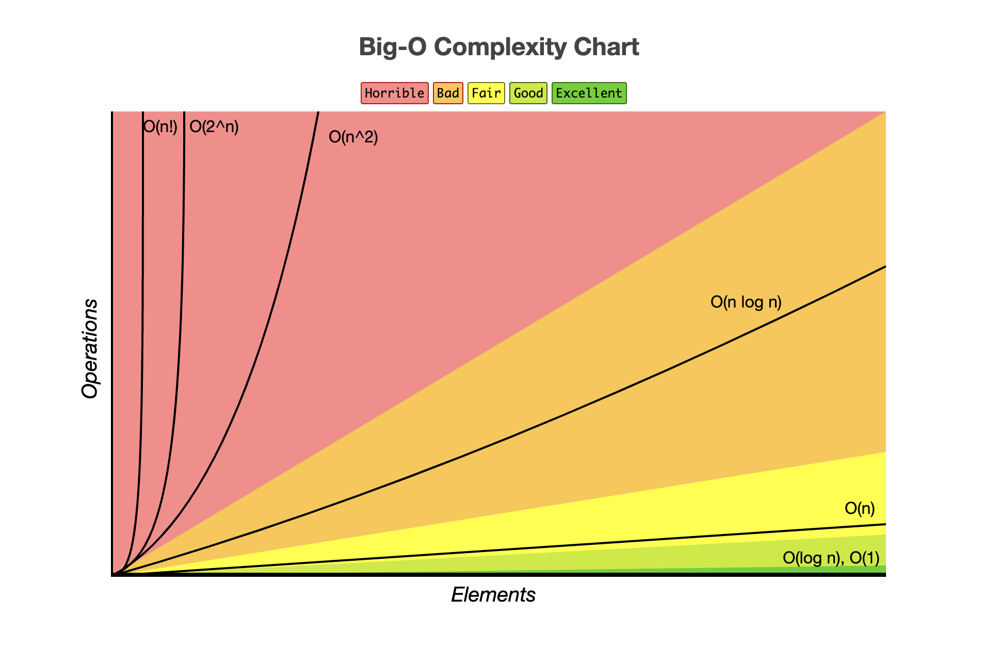

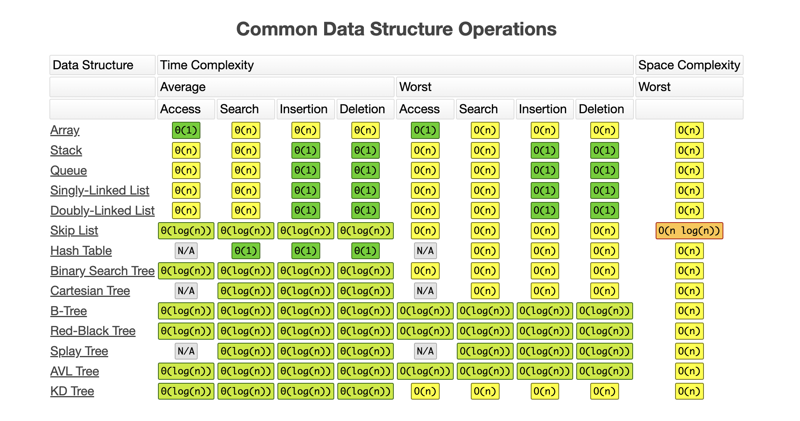

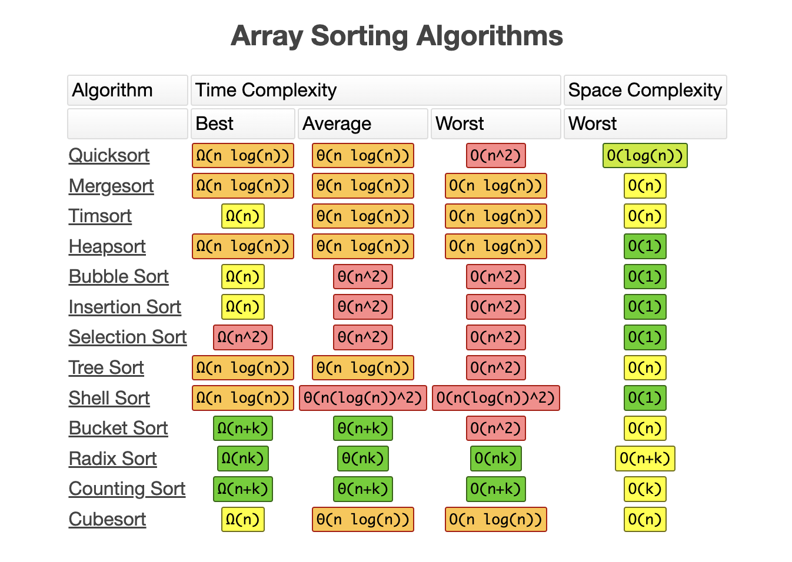

### 1.2 Merge Sort

**=>** Merge sort is a classic divide-and-conquer sorting algorithm known for its efficiency and stability. It divides the unsorted array into smaller sub-arrays until each sub-array contains only one element. Then, it merges those sub-arrays back together, sorting them as it does so.

Here's an explanation of merge sort in JavaScript along with the analysis of its time and space complexity:

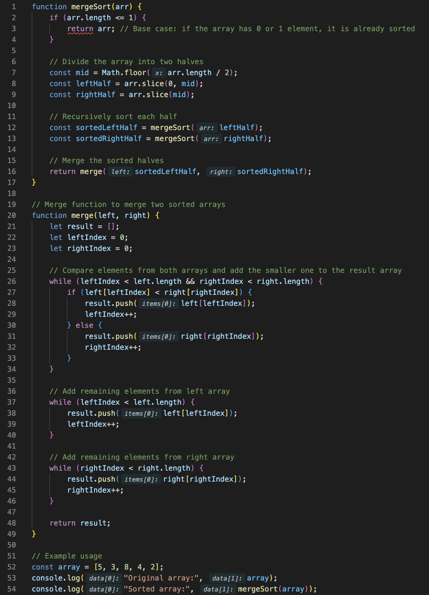

**Explanation:**

* `mergeSort` function: This is the main function that implements the merge sort algorithm. It takes an array `arr` as input. If the array has 0 or 1 element, it is already sorted, so the function simply returns the array. Otherwise, it divides the array into two halves (`leftHalf` and `rightHalf`), recursively sorts each half, and then merges them using the `merge` function.
* `merge` function: This function takes two sorted arrays `left` and `right` as input and merges them into a single sorted array. It uses two pointers (`leftIndex` and `rightIndex`) to iterate through the elements of the two arrays, comparing them and adding the smaller one to the `result` array. Once one of the arrays is fully processed, any remaining elements in the other array are added to the `result`.

**Time Complexity:**

* Merge sort has a time complexity **O**(**n**log**n**) in all cases, where **n** is the number of elements in the array. This is because the array is repeatedly divided into halves until each sub-array contains only one element, which takes **O**(**lo**g**n**) time, and then the merging process takes **O**(**n**) time.

**Space Complexity:**

* Merge sort has a space complexity of **O**(**n**) because it requires additional space to store the two halves of the array during the recursion. This additional space is proportional to the size of the input array.

## 2.Searching Algorithms

### 2.1 Binary Search

**=>** Binary search is an efficient algorithm for finding a target value within a sorted array. It works by repeatedly dividing the search interval in half and narrowing down the possible locations of the target value until it is found.

Here's an explanation of binary search in JavaScript along with the analysis of its time and space complexity:

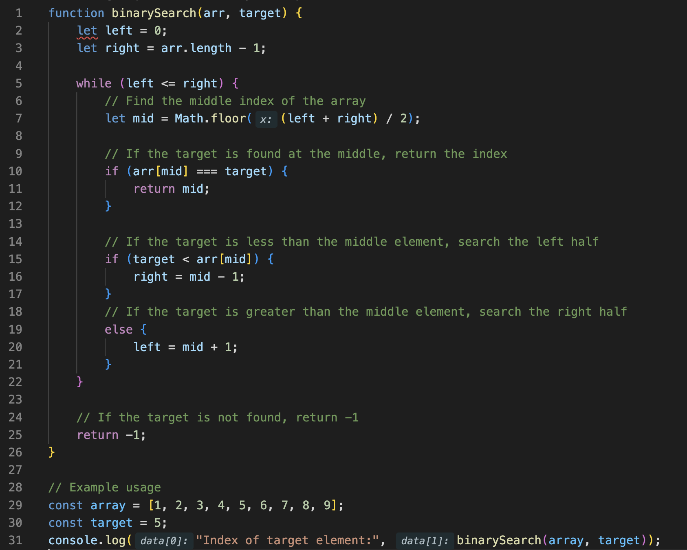

**Explanation:**

* `binarySearch` function: This is the main function that implements the binary search algorithm. It takes a sorted array `arr` and a target value `target` as input. It initializes two pointers `left` and `right` to the beginning and end of the array, respectively. It then enters a loop where it calculates the middle index (`mid`) of the current search interval and checks if the target value is equal to the value at the middle index. If the target value is found, the function returns the index of the target element. Otherwise, it updates the search interval by moving either the `left` or `right` pointer based on whether the target value is less than or greater than the value at the middle index. The loop continues until the search interval is empty (`left` is greater than `right`), indicating that the target value is not present in the array.

**Time Complexity:**

* Binary search has a time complexity of **O**(**lo**g**n**), where **n** is the number of elements in the array. This is because at each step, the search interval is divided in half, leading to a significant reduction in the number of elements to be searched.

**Space Complexity:**

* Binary search has a space complexity of **O**(**1**) because it only requires a constant amount of additional space for storing temporary variables. It does not require any additional data structures that grow with the size of the input array.

### 2.2 Linear Search

**=>** Linear search is a simple search algorithm that sequentially checks each element in a collection until a match is found or the whole collection has been searched. It is also known as a sequential search.

Here's an explanation of linear search in JavaScript along with the analysis of its time and space complexity:

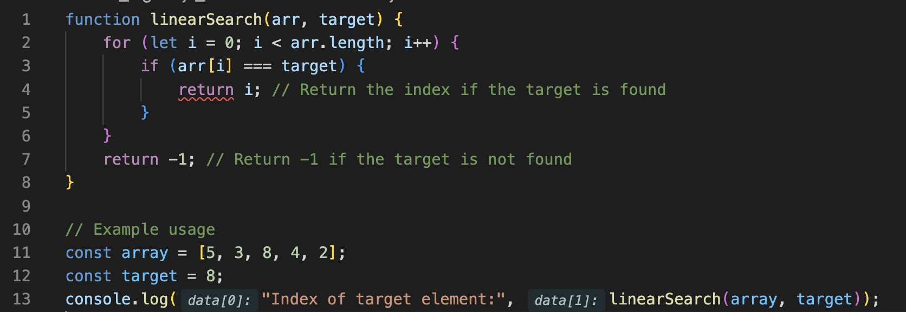

**Explanation:**

* `linearSearch` function: This is the main function that implements the linear search algorithm. It takes an array `arr` and a target value `target` as input. It iterates through each element of the array using a `for` loop. At each iteration, it compares the current element with the target value. If a match is found, it returns the index of the element. If the entire array is traversed and no match is found, it returns -1 to indicate that the target value is not present in the array.

**Time Complexity:**

* In the worst-case scenario, where the target value is not present in the array or is present at the last position, linear search has a time complexity of **O**(**n**), where **n** is the number of elements in the array. This is because it may need to iterate through the entire array to find the target value.
* In the best-case scenario, where the target value is found at the first position, linear search has a time complexity of **O**(**1**). However, this is an unlikely scenario and is not typical.

**Space Complexity:**

* Linear search has a space complexity of **O**(**1**) because it only requires a constant amount of additional space for storing temporary variables. It does not require any additional data structures that grow with the size of the input array.

## 3. Recursion

**=>** Recursion is a programming technique where a function calls itself in order to solve a problem. It's a fundamental concept in computer science and is widely used in various algorithms and data structures. Recursive functions break down a problem into smaller subproblems and solve each subproblem recursively until a base case is reached, at which point the function stops calling itself and returns a result.

Here's an explanation of recursion in JavaScript along with the analysis of its time and space complexity:

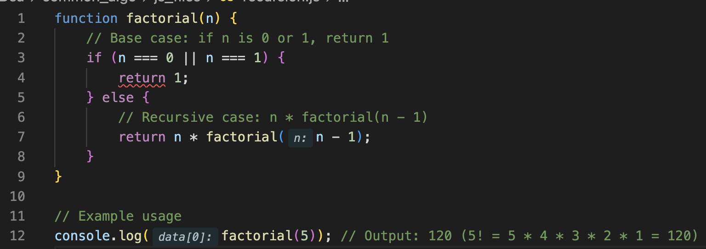

**Explanation:**

* `factorial` function: This is a recursive function that calculates the factorial of a non-negative integer `n`. The factorial of a non-negative integer `n`, denoted as `n!`, is the product of all positive integers less than or equal to `n`. The function has a base case where if `n` is 0 or 1, it returns 1. Otherwise, it recursively calls itself with `n - 1` and multiplies the result by `n`.

**Time Complexity:**

* The time complexity of a recursive function depends on the number of recursive calls made and the work done at each call. In the case of the `factorial` function, each recursive call reduces the value of `n` by 1 until the base case is reached. Therefore, the time complexity of the `factorial` function is **O**(**n**), where **n** is the value of the input parameter.

**Space Complexity:**

* The space complexity of a recursive function depends on the number of recursive calls made and the space required to store the call stack. In the case of the `factorial` function, since there are **n** recursive calls made (one for each integer from **n** down to 1), the space complexity is also **O**(**n**) due to the size of the call stack. However, in many cases, tail recursion optimization can be applied to reduce the space complexity to **O**(**1**) by reusing the same stack frame for each recursive call. Unfortunately, JavaScript does not currently optimize tail recursion.

## 4. Dynamic Programing

**=>** Dynamic programming (DP) is a powerful problem-solving technique used to solve problems by breaking them down into simpler subproblems and solving each subproblem only once. It's especially useful for optimization problems where the solution can be built incrementally.

Here's an explanation of dynamic programming in JavaScript along with the analysis of its time and space complexity:

Dynamic programming typically involves two approaches: memoization and tabulation.

1. **Memoization** :

* In memoization, we store the results of expensive function calls and return the cached result when the same inputs occur again.
* We can use memoization to optimize recursive algorithms by storing the results of subproblems in a data structure (such as an object or an array) and reusing those results instead of recomputing them.
* This approach is particularly useful when the recursive algorithm has overlapping subproblems, meaning the same subproblems are solved repeatedly.

1. **Tabulation** :

* In tabulation, we solve the problem bottom-up by iteratively filling a table or array.
* We start with the simplest subproblems and gradually build up to the desired solution.
* This approach is often used when the problem can be naturally expressed as a series of overlapping subproblems.

Here's an example of dynamic programming in JavaScript using the Fibonacci sequence:

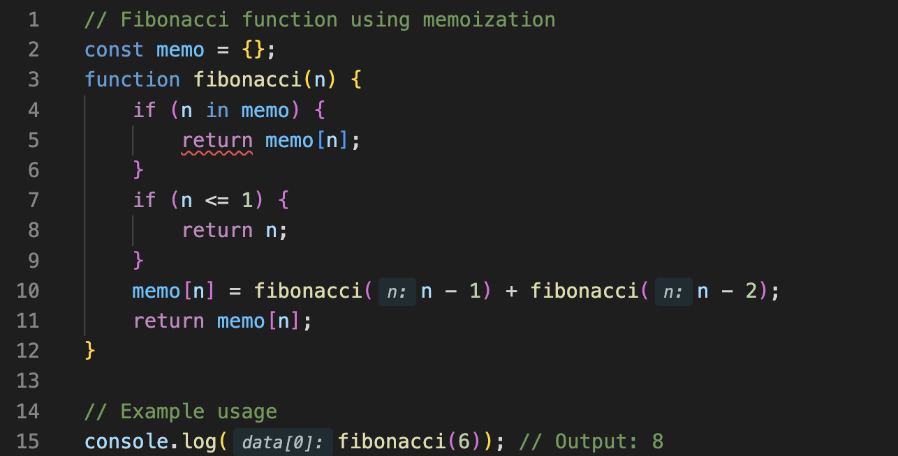

**Time Complexity** :

* With memoization or tabulation, the time complexity of dynamic programming algorithms depends on the number of distinct subproblems solved.
* In the case of the Fibonacci sequence using memoization, the time complexity is **O**(**n**), where **n** is the input parameter.
* Tabulation-based dynamic programming algorithms also typically have a time complexity of **O**(**n**) because they involve filling up a table of size **n** in a bottom-up manner.

 **Space Complexity** :

* The space complexity of dynamic programming algorithms depends on whether memoization or tabulation is used and the size of the data structure used to store the results of subproblems.
* In the case of memoization, the space complexity is **O**(**n**) due to the space required to store the results of subproblems in the memoization table.
* In the case of tabulation, the space complexity is also **O**(**n**) due to the space required to store the table or array used to solve subproblems iteratively.
