# SDE INTERVIEW DSA SHEET

## ARRAYS

### Q 1. Binary Search

Given an array of integers nums which is sorted in ascending order, and an integer target, write a function to search target in nums. If target exists, then return its index. Otherwise, return -1. You must write an algorithm with O(log n) runtime complexity.

**Example 1:**
Input: nums = [-1,0,3,5,9,12], target = 9
Output: 4

**=>** To search for a target integer in a sorted array `nums` with O(log n) runtime complexity, we can use the binary search algorithm. Here's how you can implement it in JavaScript:

In this implementation:

* We maintain two pointers, `left` and `right`, initially set to the first and last indices of the array, respectively.
* In each iteration of the `while` loop, we calculate the middle index `mid` and check if the element at `mid` is equal to the target. If it is, we return `mid` as the index of the target.
* If the element at `mid` is less than the target, we update `left` to `mid + 1` to continue searching in the right half of the array.
* If the element at `mid` is greater than the target, we update `right` to `mid - 1` to continue searching in the left half of the array.
* We repeat this process until `left` is greater than `right`, indicating that the target is not present in the array, in which case we return -1.

**=>** This implementation has O(log n) runtime complexity, as we effectively halve the search space in each iteration of the binary search algorithm.

### Q 2. Find the Duplicate Number

is in the range [1, n] inclusive.
There is only one repeated number in nums, return this repeated number.
You must solve the problem without modifying the array nums and uses only constant extra space.

**Example 1:**
Input: nums = [1,3,4,2,2]
Output: 2

**=>** To find the repeated number in the array `nums` without modifying the array and using only constant extra space, we can use the **Floyd's Tortoise and Hare algorithm**, also known as the **cycle detection algorithm**. This algorithm is used to detect cycles in linked lists but can be adapted to find duplicate elements in an array.

Here's how you can implement it in JavaScript:

 In this implementation:

* We initialize two pointers, `slow` and `fast`, both pointing to the first element of the array.
* In Phase 1, we move the `slow` pointer one step at a time and the `fast` pointer two steps at a time until they meet at an intersection point within a cycle in the array.
* In Phase 2, we reset the `slow` pointer to the first element of the array and move both pointers one step at a time until they meet at the entrance to the cycle.
* The number at which the two pointers meet in Phase 2 is the repeated number in the array.

**=>** This implementation has a time complexity of O(n) and space complexity of O(1), meeting the requirements of the problem.

#### Floyd's Tortoise and Hare algorithm

**=>** Floyd's Tortoise and Hare algorithm, also known as cycle detection algorithm, is used to detect cycles in linked lists or sequences. It works by having two pointers traverse the sequence at different speeds. If there's a cycle, the two pointers will eventually meet at some point.

Here's how you can implement Floyd's Tortoise and Hare algorithm in JavaScript for detecting cycles in a linked list:

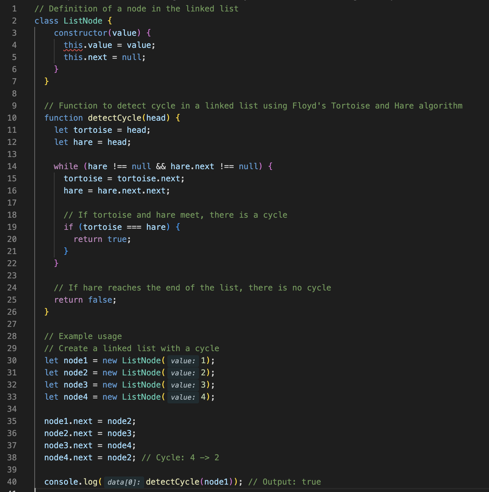

In this implementation:

* We define a `ListNode` class to represent each node in the linked list.
* The `detectCycle` function takes the head of the linked list as input and returns `true` if there is a cycle, and `false` otherwise.
* The tortoise and hare pointers initially start at the head of the linked list.
* The tortoise moves one step at a time while the hare moves two steps at a time.
* If there is a cycle, the tortoise and hare will eventually meet at some point.
* If the hare reaches the end of the list (`hare === null` or `hare.next === null`), then there is no cycle in the list.

### Q 3. Search Insert Position

Given a sorted array of distinct integers and a target value, return the index if the target is found. If not, return the index where it would be if it were inserted in order.
You must write an algorithm with O(log n) runtime complexity.

**Example 1:**
Input: nums = [1,3,4,2,2]
Output: 2

**=>** To find the index where the target value should be inserted in a sorted array of distinct integers, we can use a modified version of the **binary search algorithm**. Here's how you can implement it in JavaScript:

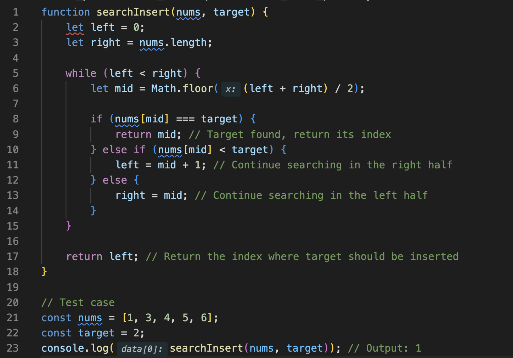

In this implementation:

* We maintain two pointers, `left` and `right`, initially set to the first and last indices of the array, respectively.
* In each iteration of the `while` loop, we calculate the middle index `mid` and compare the element at `mid` with the target value.
* If the element at `mid` is equal to the target, we return `mid` as the index of the target.
* If the element at `mid` is less than the target, we update `left` to `mid + 1` to continue searching in the right half of the array.
* If the element at `mid` is greater than or equal to the target, we update `right` to `mid` to continue searching in the left half of the array.
* We repeat this process until `left` is equal to `right`, indicating the position where the target should be inserted.

**=>** This implementation has O(log n) runtime complexity, meeting the requirements of the problem.

### Q 4. Sort Colors

Given an array nums with n objects colored red, white, or blue, sort them inplace so that objects of the same color are adjacent, with the colors in the order red, white, and blue. We will use the integers 0, 1, and 2 to represent the color red, white, and blue, respectively.
You must solve this problem without using the library's sort function.

**Example 1:**
Input: nums = [2,0,2,1,1,0]
Output: [0,0,1,1,2,2]

**=>** You can solve this problem using the **Dutch National Flag algorithm,** which is also known as the **three-way partitioning algorithm**. It works by maintaining three pointers: `low`, `mid`, and `high`, to partition the array into three segments: elements less than the pivot, elements equal to the pivot, and elements greater than the pivot.

Here's how you can implement it in JavaScript:

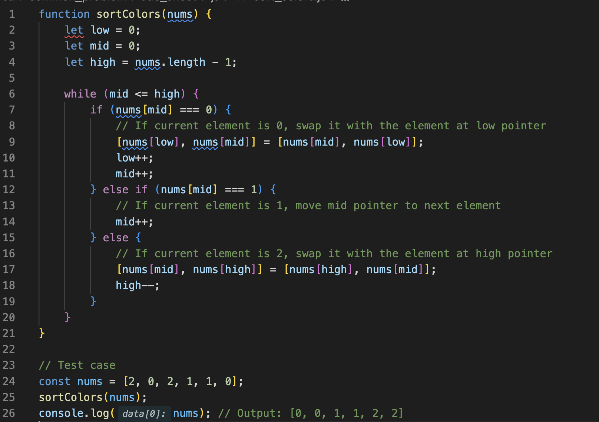

In this implementation:

* We initialize three pointers: `low` pointing to the start of the array, `mid` pointing to the current element being processed, and `high` pointing to the end of the array.
* We iterate through the array using the `mid` pointer.
* If the current element is 0, we swap it with the element at the `low` pointer and increment both `low` and `mid` pointers.
* If the current element is 1, we simply move the `mid` pointer to the next element.
* If the current element is 2, we swap it with the element at the `high` pointer and decrement the `high` pointer.
* We repeat this process until the `mid` pointer crosses the `high` pointer, ensuring that all elements are properly partitioned.

**=>** This implementation sorts the array in-place with a time complexity of O(n), where n is the number of elements in the array.

#### The Dutch National Flag algorithm

**=>** The Dutch National Flag algorithm, also known as the 3-way partitioning algorithm, is used to sort an array containing three distinct values. It was designed by Edsger W. Dijkstra, a Dutch computer scientist, and it's particularly efficient for sorting arrays with a small number of unique elements.

Here's the implementation of the Dutch National Flag algorithm in JavaScript:

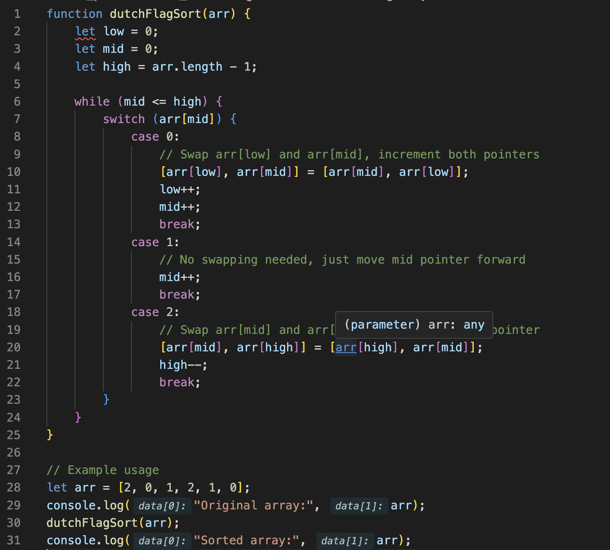

In this implementation:

* We initialize three pointers: `low`, `mid`, and `high`, representing the boundaries of three partitions in the array.
* The `low` pointer points to the starting index of the 0 partition, initially at index 0.
* The `mid` pointer starts at index 0 and moves through the array to process each element.
* The `high` pointer points to the ending index of the 2 partition, initially at index `arr.length - 1`.
* Inside the `while` loop, we switch on the value of `arr[mid]`:
  * If it's `0`, we swap `arr[mid]` with `arr[low]`, increment both `low` and `mid`.
  * If it's `1`, we don't need to swap anything; we just increment `mid`.
  * If it's `2`, we swap `arr[mid]` with `arr[high]`, decrement `high`.
* The loop continues until `mid` is greater than `high`, meaning we've processed all elements.
* At the end, the array is sorted with all 0s appearing before 1s and all 1s appearing before 2s.

### Q 5. Find First and Last Position of Element in Sorted Array

Given an array of integers nums sorted in non-decreasing order, fnd the starting and ending position of a given target value. If target is not found in the array, return [-1, -1].
You must write an algorithm with O(log n) runtime complexity.

**Example 1:**
Input: nums = [5,7,7,8,8,10], target = 8
Output: [3,4]

**=>** To find the starting and ending positions of a given target value in a sorted array of integers with O(log n) runtime complexity, you can use a modified **binary search algorithm**.

Here's how you can implement it in JavaScript:

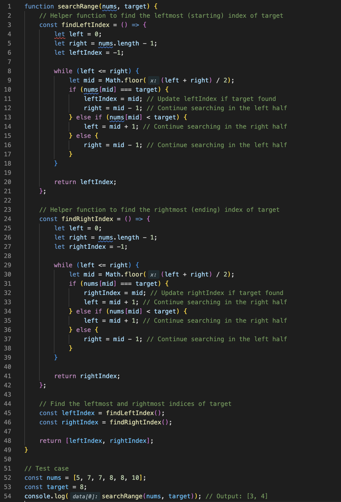

**=>** In this implementation:

* We define two helper functions `findLeftIndex()` and `findRightIndex()` to find the leftmost (starting) index and the rightmost (ending) index of the target value using binary search.
* We perform two binary searches: one to find the leftmost index and another to find the rightmost index.
* We return the pair `[leftIndex, rightIndex]`, representing the starting and ending positions of the target value in the array. If the target is not found, we return `[-1, -1]`.
* Both binary searches have a time complexity of O(log n), resulting in an overall time complexity of O(log n) for the `searchRange` function.

### Q 6. Length of Last Word

Given a string s consisting of words and spaces, return the length of the last word in the string.
A word is a maximal substring consisting of non-space characters only.

**Example 1:**
Input: s = "Hello World"
Output: 5

**=>** You can solve this problem by first trimming any trailing spaces from the input string and then iterating from the end of the string to find the length of the last word. Here's how you can implement it in JavaScript:

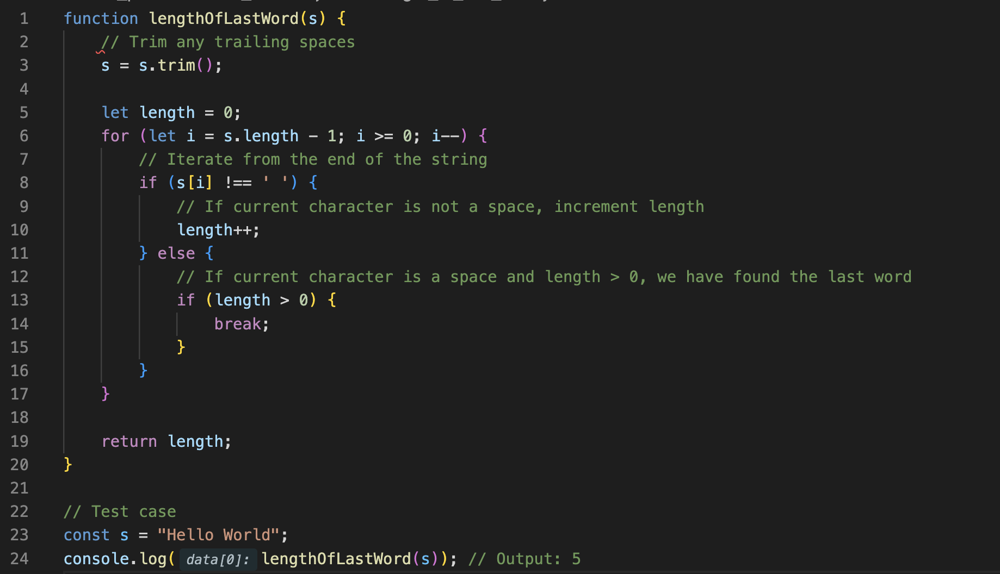

In this implementation:

* We first trim any trailing spaces from the input string using the `trim()` method.
* Then, we iterate from the end of the string towards the beginning.
* We count the length of the last word until we encounter a space character.
* Once we encounter a space character, we check if the length is greater than 0. If it is, we break out of the loop, as we have found the last word.
* Finally, we return the length of the last word.

**=>** This solution has a time complexity of O(n), where n is the length of the input string.

### Q 7. Set Matrix Zeroes

Given an m x n integer matrix matrix, if an element is 0, set its entire row and column to 0's.

You must do it in place.

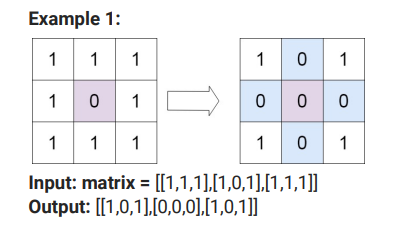

**=>** You can solve this problem by using two additional arrays to keep track of rows and columns that need to be set to zero. Here's how you can implement it in JavaScript:

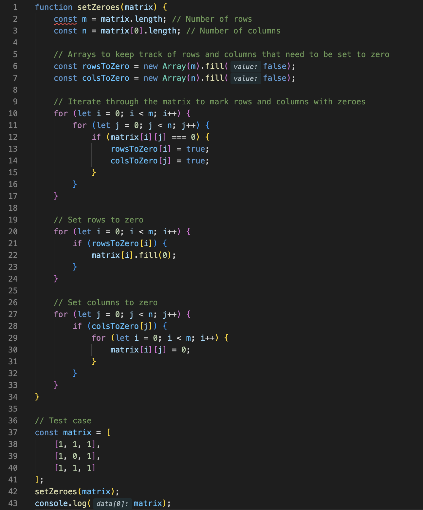

In this implementation:

* We first iterate through the matrix to mark the rows and columns that contain zeroes by setting corresponding flags in `rowsToZero` and `colsToZero` arrays.
* Then, we iterate through the matrix again to set the rows and columns with flags to zero.
* We set the rows to zero by using the `fill()` method on each row.
* We set the columns to zero by iterating through each row and setting the corresponding element to zero.

**=>** This solution has a time complexity of O(m * n), where m is the number of rows and n is the number of columns in the matrix.

### Q 8. Pascal's Triangle

Given an integer numRows, return the frst numRows of Pascal's triangle. In Pascal's triangle, each number is the sum of the two numbers directly above it as shown:

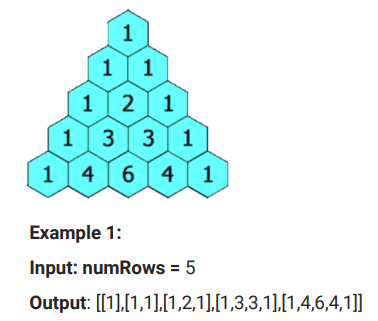

**=>** You can generate Pascal's triangle iteratively by using the previous row to compute the values of the current row. Here's how you can implement it in JavaScript:

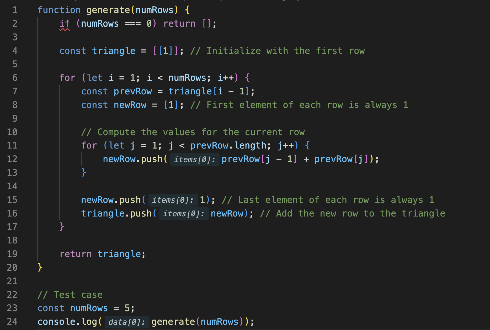

This implementation:

* Starts by initializing the triangle with the first row, which is `[1]`.
* Then, iterates from the second row up to `numRows`, computing each row based on the values of the previous row.
* Computes each value in the current row by summing the corresponding elements from the previous row.
* Adds the newly computed row to the triangle.
* Returns the generated Pascal's triangle.

**=>** The time complexity of this solution is O(numRows^2), where numRows is the number of rows in Pascal's triangle.

### Q 9. Single Element in a Sorted Array

You are given a sorted array consisting of only integers where every element appears exactly twice, except for one element which appears exactly once.
Return the single element that appears only once.
Your solution must run in O(log n) time and O(1) space.

**Example 1:**
Input: nums = [1,1,2,3,3,4,4,8,8]
Output: 2

**=>** To find the single element that appears only once in the sorted array with O(log n) time complexity and O(1) space complexity, you can utilize **binary search**. Since the array is sorted and the single element appears exactly once, you can notice that all elements before and after the single element will appear twice.

Here's how you can implement it:

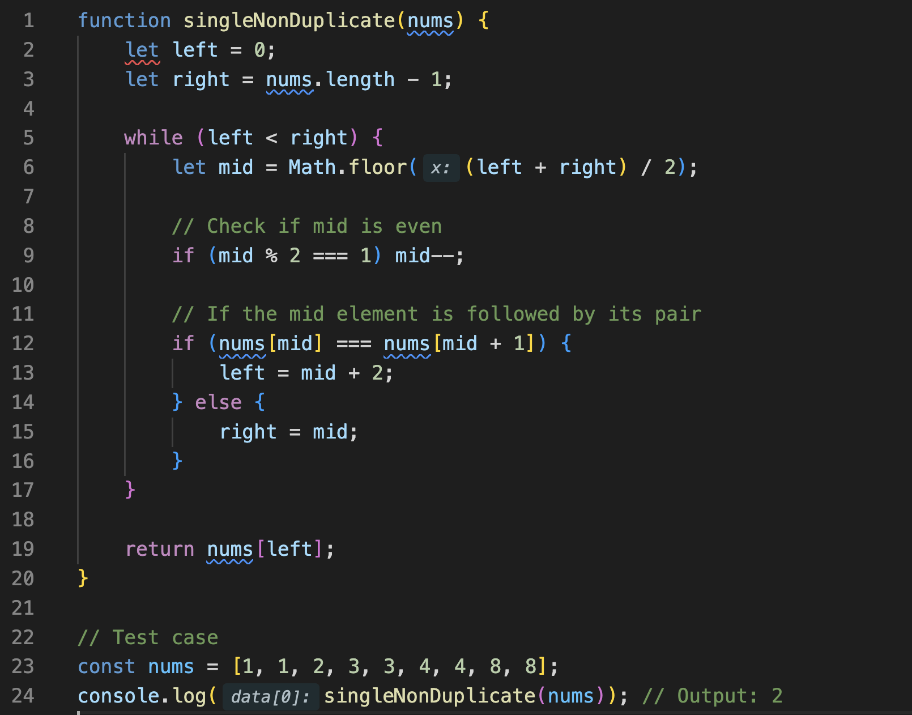

In this implementation:

* We set two pointers, `left` and `right`, to the start and end of the array, respectively.
* We perform binary search by continuously narrowing down the search range until `left` is equal to `right`.
* At each step, we calculate the middle index (`mid`), ensuring it is an even index (to ensure the pairs are correctly positioned).
* We compare the element at `mid` with its adjacent element to check if it is a part of a pair or not.
* If the element at `mid` is followed by its pair, we adjust the search range to the right side. Otherwise, we adjust it to the left side.
* Finally, when `left` is equal to `right`, we return the element at the `left` index, which is the single element appearing only once.

**=>** This algorithm has a time complexity of O(log n) and a space complexity of O(1).

### Q 10. Search a 2D Matrix

You are given an m x n integer matrix matrix with the following two properties:
• Each row is sorted in non-decreasing order.
• The frst integer of each row is greater than the last integer of the previous row.
Given an integer target, return true if target is in matrix or false otherwise.
You must write a solution in O(log(m * n)) time complexity.

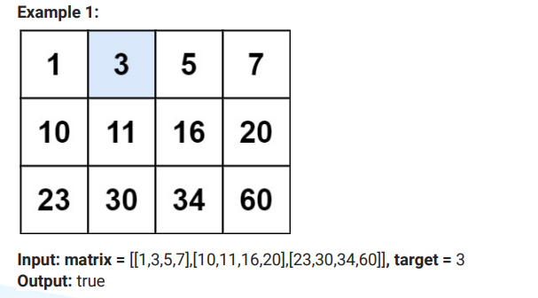

**=>** To solve this problem efficiently, we can utilize **binary search** since the matrix has the property that each row is sorted in non-decreasing order and the first integer of each row is greater than the last integer of the previous row.

Here's how we can implement the solution:

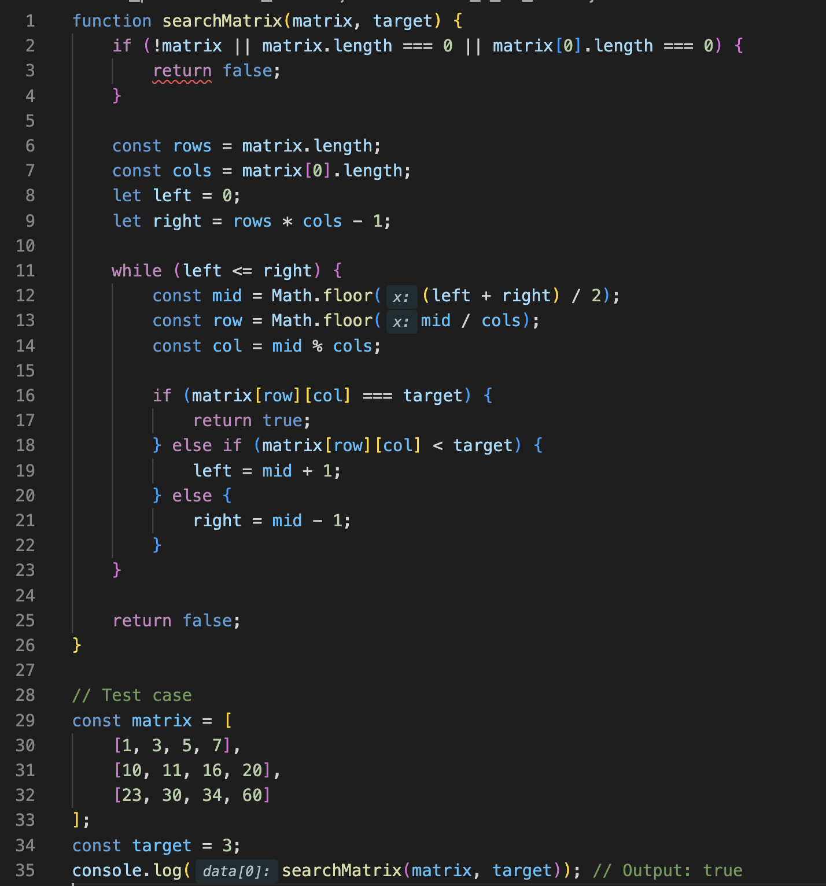

In this implementation:

* We initialize `left` to 0 and `right` to `rows * cols - 1`, representing the indices of the first and last elements in the flattened matrix.
* We perform binary search by continuously narrowing down the search range until `left` becomes greater than `right`.
* At each step, we calculate the middle index (`mid`) and then convert it back to row and column indices using modular arithmetic.
* We compare the element at the calculated indices with the target value and adjust the search range accordingly.
* If the target is found, we return `true`. Otherwise, we return `false` after the search completes.

**=>** This algorithm has a time complexity of O(log(m * n)), where m is the number of rows and n is the number of columns in the matrix.

### Q 11. Pow(x, n)

Implement pow(x, n), which calculates x raised to the power n (i.e., xn).

**Example 1:**
Input: x = 2.00000, n = 10
Output: 1024.00000

**=>** You can implement the `pow` function using a **recursive approach**. Here's how you can do it in JavaScript:

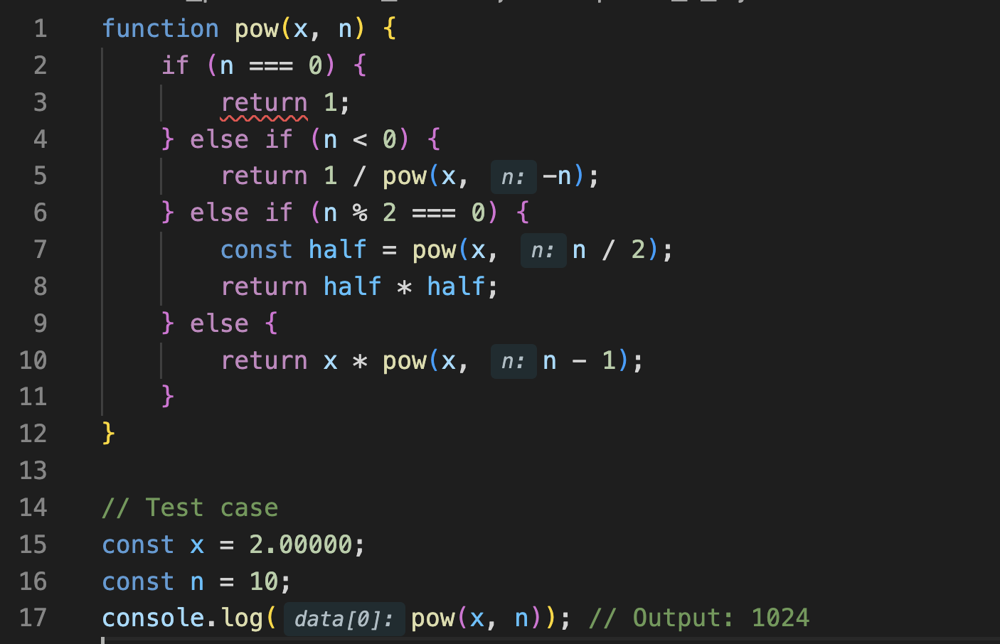

This implementation works as follows:

* If the exponent `n` is 0, return 1.
* If `n` is negative, return the reciprocal of `pow(x, -n)`.
* If `n` is even, calculate `pow(x, n/2)` and square it.
* If `n` is odd, calculate `pow(x, n - 1)` and multiply it by `x`.

**=>** This approach has a time complexity of O(log n) since each recursive call reduces the exponent by half, resulting in a logarithmic number of recursive calls.

#### Recursion

**=>** Certainly! Recursion is a programming technique where a function calls itself in order to solve a problem. In JavaScript, like in many programming languages, you can use recursion to solve various types of problems, such as traversing tree structures, calculating factorials, searching through arrays, and more.

Here's a simple example of recursion in JavaScript:

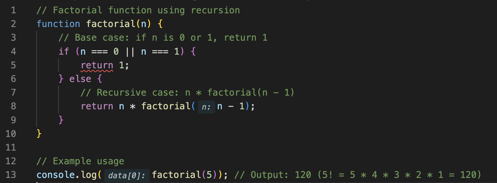

In this example:

* The `factorial` function calculates the factorial of a non-negative integer `n`.
* The base case is when `n` is 0 or 1, in which case the factorial is 1.
* The recursive case multiplies `n` by the factorial of `n - 1`.
* Each recursive call reduces the value of `n` until it reaches the base case.
* Once the base case is reached, the recursion stops, and the function returns the result.

Recursion can be a powerful tool for solving problems, but it's essential to ensure that there's a base case that will eventually terminate the recursion, preventing infinite loops. Also, excessive recursion can lead to stack overflow errors, so it's crucial to use recursion judiciously and consider potential performance implications.

### Q 12. Find a Peak Element II

A peak element in a 2D grid is an element that is strictly greater than all of its adjacent neighbors to the left, right, top, and bottom.
Given a 0-indexed m x n matrix mat where no two adjacent cells are equal, fnd any peak element mat[i][j] and return the length 2 array [i,j].
You may assume that the entire matrix is surrounded by an outer perimeter with the value -1 in each cell.
You must write an algorithm that runs in O(m log(n)) or O(n log(m)) time.

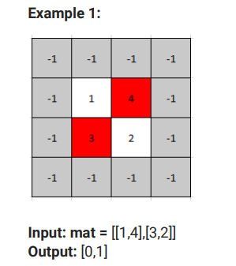

**=>** To find a peak element in a 2D grid, you can use a **binary search approach**. Here's how you can do it in JavaScript:

**=>** This implementation performs a binary search on the columns of the matrix. In each iteration, it finds the maximum value in the middle column (`mid`), and then checks if it satisfies the conditions of being a peak element. If not, it adjusts the search range accordingly. This algorithm has a time complexity of O(m log n) or O(n log m) depending on whether m or n is greater.

### Q 13. Max Value of Equation

You are given an array points containing the coordinates of points on a 2D plane, sorted by the x-values, where points[i] = [xi, yi] such that xi < xj for all 1 <= i < j <= points.length. You are also given an integer k.
Return the maximum value of the equation yi + yj + |xi - xj| where |xi - xj| <= k and 1 <= i < j <= points.length.
It is guaranteed that there exists at least one pair of points that satisfy the constraint |xi - xj| <= k.

**Example 1:**
Input: x = [[1,3],[2,0],[5,10],[6,-10]], k = 1, n = 1
Output: 4

**=>**  To solve this problem, you can use a **sliding window approach**. Here's how you can do it in JavaScript:

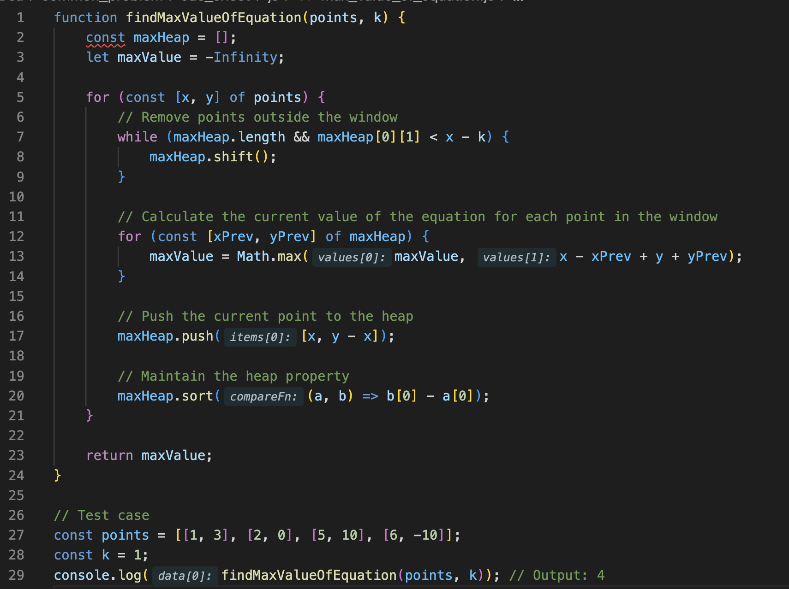

**=>** In this implementation, we use a max heap to store the points within the window. At each step, we remove points that are outside the window, calculate the current value of the equation for each pair of points within the window, and update the `maxValue` accordingly. Finally, we return the maximum value found. This algorithm has a time complexity of O(n log n), where n is the number of points.

#### Sliding window

A sliding window is a technique used to solve problems involving arrays or strings where you need to perform operations on a contiguous subarray or substring of a certain size. The window "slides" through the array or string, allowing you to efficiently perform operations on each subarray or substring.

Here's a basic implementation of a sliding window in JavaScript:

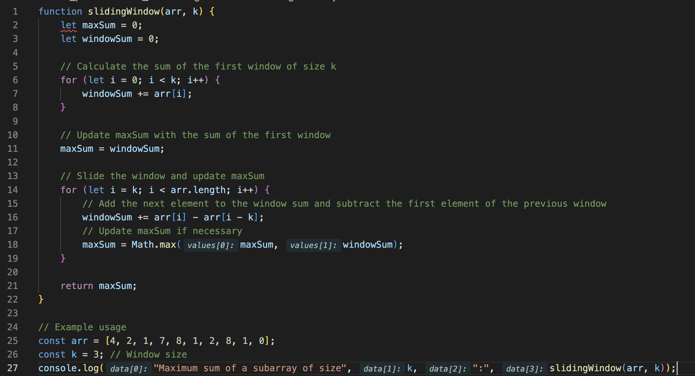

In this example:

* The `slidingWindow` function takes an array `arr` and a window size `k` as input.
* It initializes two variables, `maxSum` and `windowSum`, to keep track of the maximum sum found so far and the sum of the current window, respectively.
* It calculates the sum of the first window of size `k`.
* It updates `maxSum` with the sum of the first window.
* It iterates through the array, starting from index `k`, sliding the window one element at a time.
* For each iteration, it adds the next element to the window sum and subtracts the first element of the previous window.
* It updates `maxSum` with the maximum of `maxSum` and `windowSum`.
* Finally, it returns `maxSum`, which represents the maximum sum of a subarray of size `k` in the array `arr`.

This is just one example of how you can use a sliding window technique in JavaScript. Sliding windows can be applied to various problems, such as finding maximum or minimum subarrays, finding the longest substring with distinct characters, and more.

### Q 14. Jump Game

You are given an integer array nums. You are initially positioned at the array's frst index, and each element in the array represents your maximum jump length at that position.
Return true if you can reach the last index, or false otherwise.

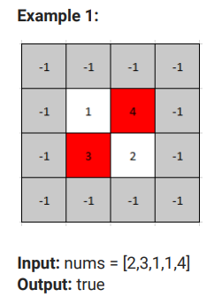

=> You can solve this problem using a **greedy approach**. Here's how you can implement it in JavaScript:

**=>** In this implementation, we iterate through the array, keeping track of the maximum reachable index (`maxReach`). At each step, we update `maxReach` to be the maximum of its current value and the sum of the current index and the value at that index in the `nums` array. If at any point `maxReach` exceeds or reaches the last index of the array, we return `true`. If we encounter an index that is beyond `maxReach`, we return `false` because we cannot reach the end of the array from that position.

#### Greedy algorithm

A greedy algorithm is a problem-solving approach that makes the locally optimal choice at each step with the hope of finding a global optimum. Greedy algorithms are used in optimization problems where the solution is built step by step. At each step, the algorithm selects the best available option without considering the overall consequences. Greedy algorithms are often straightforward to implement and can be efficient, but they may not always produce the optimal solution.

Here's a simple example of a greedy algorithm in JavaScript to solve the "coin change" problem:

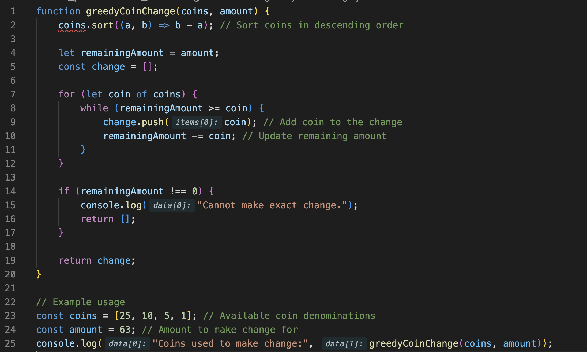

In this example:

* The `greedyCoinChange` function takes an array of coin denominations `coins` (assumed to be sorted in descending order) and an `amount` for which we want to make change.
* We initialize `remainingAmount` to the given `amount` and an empty array `change` to keep track of the coins used to make change.
* We iterate through the `coins` array and, at each step, we use as many coins of the current denomination as possible while updating `remainingAmount`.
* If `remainingAmount` is not zero after going through all the coins, it means we cannot make exact change, so we return an empty array.
* Otherwise, we return the `change` array, which contains the coins used to make change.

Note: While greedy algorithms are simple and efficient, they may not always produce the optimal solution. In the case of the coin change problem, this greedy approach works because the coin denominations are in denominations of powers of 10, which makes it possible to always choose the largest coin denomination less than or equal to the remaining amount. However, this approach may not work for arbitrary coin denominations.
