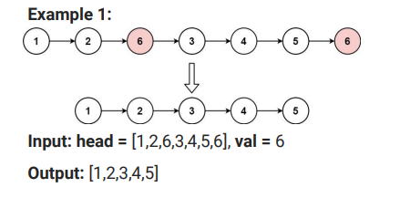

# SDE INTERVIEW DSA SHEET LINKED LIST

## LINKED LIST

### Q 1. Delete Node in a Linked List

There is a singly-linked list head and we want to delete a node node in it. 

You are given the node to be deleted node. You will not be given access to the frst node of head. 

All the values of the linked list are unique, and it is guaranteed that the given node node is not the last node in the linked list.

Delete the given node. Note that by deleting the node, we do not mean removing it from memory. We mean:
• The value of the given node should not exist in the linked list.
• The number of nodes in the linked list should decrease by one.
• All the values before node should be in the same order.
• All the values after node should be in the same order.
Custom testing:
• For the input, you should provide the entire linked list head and the node
to be given node. node should not be the last node of the list and should
be an actual node in the list.
• We will build the linked list and pass the node to your function.
• The output will be the entire list after calling your function.

**=>** To delete a node from a singly-linked list without having access to the head node, we can follow these steps:

1. Copy the value of the next node to the current node.
2. Change the current node's next pointer to skip the next node and point to the node after it.

Here's the JavaScript code to implement this approach:

**Explanation:**

* We copy the value of the next node to the current node, effectively replacing the value of the current node with the value of the next node.
* Then, we skip the next node by changing the `next` pointer of the current node to point to the node after the next node.
* This effectively removes the next node from the linked list.

**Time Complexity:**
The time complexity of this approach is O(1), as we only need to perform a constant number of operations regardless of the size of the linked list.

**Space Complexity:**
The space complexity is O(1) as well, as we do not use any extra space proportional to the input size.

### Q 2. Middle of the Linked List

Given the head of a singly linked list, return the middle node of the linked list.
If there are two middle nodes, return the second middle node.

**=>** To find the middle node of a singly linked list, we can use the two-pointer approach. We'll use two pointers, one slow pointer and one fast pointer. The slow pointer moves one step at a time, while the fast pointer moves two steps at a time. When the fast pointer reaches the end of the list, the slow pointer will be at the middle node.

Here's how we can implement this in JavaScript:

**Explanation:**

* We initialize both the slow and fast pointers to the head of the linked list.
* We move the slow pointer one step forward and the fast pointer two steps forward in each iteration until the fast pointer reaches the end of the list.
* When the fast pointer reaches the end of the list, the slow pointer will be at the middle node.

**Time Complexity:**
The time complexity of this approach is O(N), where N is the number of nodes in the linked list. We traverse the linked list once.

**Space Complexity:**
The space complexity is O(1) because we only use a constant amount of extra space regardless of the size of the input linked list.

### Q 3. Reverse Linked List

Given the head of a singly linked list, reverse the list, and return the reversed list.

**=>** To reverse a singly linked list, we can use an iterative approach where we maintain three pointers: `prev`, `current`, and `next`.

Here's how we can implement this in JavaScript:

**Explanation:**

* We initialize `prev` to `null`, `current` to `head`, and loop through the list until `current` becomes `null`.
* In each iteration, we save the next node of `current` in the variable `next`.
* We reverse the link by setting `current.next` to `prev`.
* Then, we move `prev` and `current` one step forward by assigning `current` to `next` and updating `prev` to `current`.
* Finally, after the loop, `prev` will be the new head of the reversed list.

**Time Complexity:**
The time complexity of this approach is O(N), where N is the number of nodes in the linked list. We traverse the linked list once.

**Space Complexity:**
The space complexity is O(1) because we only use a constant amount of extra space regardless of the size of the input linked list.

### Q 4. Linked List Cycle

Given head, the head of a linked list, determine if the linked list has a cycle in it.
There is a cycle in a linked list if there is some node in the list that can be reached again by continuously following the next pointer. Internally, pos is used to denote the index of the node that tail's next pointer is connected to.
Note that pos is not passed as a parameter.
Return true if there is a cycle in the linked list. Otherwise, return false.

**=>** To determine if a linked list contains a cycle, we can use the Floyd's Tortoise and Hare algorithm (also known as the slow and fast pointer technique). In this algorithm, we use two pointers: one slow pointer that moves one step at a time and one fast pointer that moves two steps at a time. If there is a cycle in the linked list, eventually the fast pointer will catch up to the slow pointer.

Here's how we can implement this in JavaScript:

**Explanation:**

* We start with two pointers, `slow` and `fast`, both initialized to the `head`.
* In each iteration of the while loop, we move the `slow` pointer one step forward and the `fast` pointer two steps forward.
* If there is no cycle, the `fast` pointer will reach the end of the list (null) before the `slow` pointer catches up to it.
* If there is a cycle, eventually the `fast` pointer will catch up to the `slow` pointer, indicating the presence of a cycle.

**Time Complexity:**
The time complexity of this approach is O(N), where N is the number of nodes in the linked list. In the worst case, the fast pointer traverses the list twice.

**Space Complexity:**
The space complexity is O(1) because we only use a constant amount of extra space regardless of the size of the input linked list.

### Q 5. Remove Linked List Elements

remove all the nodes of the linked list that has Node.val == val, and return the new head.

**=>** To remove all nodes from a linked list that have a specific value `val`, we can iterate through the linked list and remove nodes with the given value while updating the pointers accordingly.

Here's how we can implement this in JavaScript:

**Explanation:**

* We create a dummy node at the beginning of the linked list to handle cases where the first node needs to be removed.
* We iterate through the linked list using two pointers: `prev` and `current`.
* If the value of the current node (`current.val`) matches the given value `val`, we skip the current node by updating the `next` pointer of the previous node (`prev.next`) to skip over the current node.
* Otherwise, we move both `prev` and `current` pointers forward.
* Finally, we return the `next` pointer of the dummy node, which represents the head of the updated linked list.

**Time Complexity:**
The time complexity of this approach is O(N), where N is the number of nodes in the linked list. We need to traverse the entire list to remove nodes with the given value.

**Space Complexity:**
The space complexity is O(1) because we only use a constant amount of extra space regardless of the size of the input linked list.
