# SDE INTERVIEW DSA SHEET

## STRING

### Q 1. Remove Outermost Parentheses

A valid parentheses string is either empty "", "(" + A + ")", or A + B, where A and B are valid parentheses strings, and + represents string concatenation.

For example, "", "()", "(())()", and "(()(()))" are all valid parentheses strings.

A valid parentheses string s is primitive if it is nonempty, and there does not
exist a way to split it into s = A + B, with A and B nonempty valid parentheses
strings.
Given a valid parentheses string s, consider its primitive decomposition: s = P1 + P2 + ... + Pk, where Pi are primitive valid parentheses strings.

Return s after removing the outermost parentheses of every primitive string in the primitive decomposition of s.

**Example 1:**
Input: s = "(()())(())"
Output: "()()()"

**=>** You can solve this problem by counting the balance of parentheses. Here's how you can implement it in JavaScript:

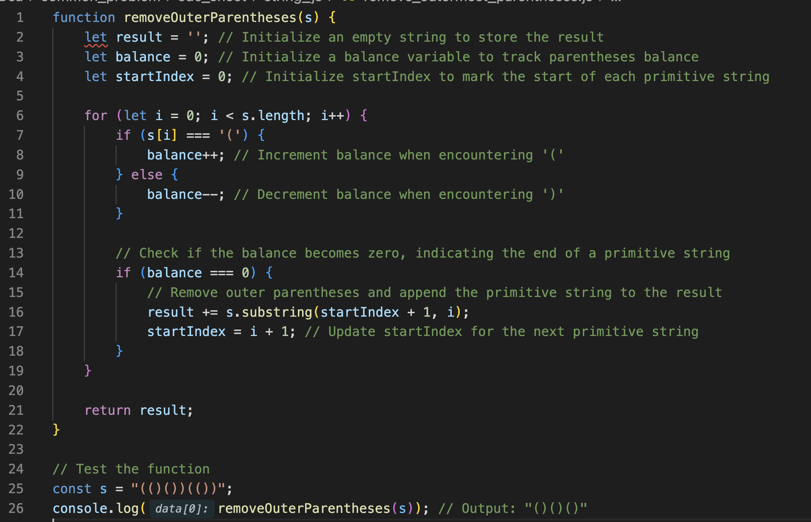

**Step-by-step Explanation:**

1. Initialize an empty string `result` to store the final output.
2. Initialize a balance variable to track the balance of parentheses. This will help identify primitive strings.
3. Initialize a `startIndex` variable to mark the start of each primitive string.
4. Iterate through each character of the input string `s`.
5. If the current character is `'('`, increment the balance. If it is `')'`, decrement the balance.
6. Check if the balance becomes zero. If yes, it indicates the end of a primitive string.
7. Remove the outer parentheses of the primitive string using `substring` and append it to the `result`.
8. Update the `startIndex` for the next primitive string.
9. Repeat steps 4-8 until the end of the input string is reached.
10. Return the final `result` string.

**Space Complexity:**

* We use a string variable `result` to store the output string. The space complexity of `result` is O(n), where n is the length of the input string `s`.
* We use a constant amount of extra space for other variables (`balance`, `startIndex`, and loop variables). So, the overall space complexity is O(n).

**Time Complexity:**

* The algorithm scans the input string `s` once in a single pass. Therefore, the time complexity is O(n), where n is the length of the input string `s`.

### Q 2. Reverse Words in a String

Given an input string s, reverse the order of the words. A word is defned as a sequence of non-space characters. The words in s will be separated by at least one space. Return a string of the words in reverse order concatenated by a single space.
Note that s may contain leading or trailing spaces or multiple spaces between two words. The returned string should only have a single space separating the words. Do not include any extra spaces.

**Example 1:**
Input: s = "the sky is blue"
Output: "blue is sky the"

**=>** Here's the solution in JavaScript:

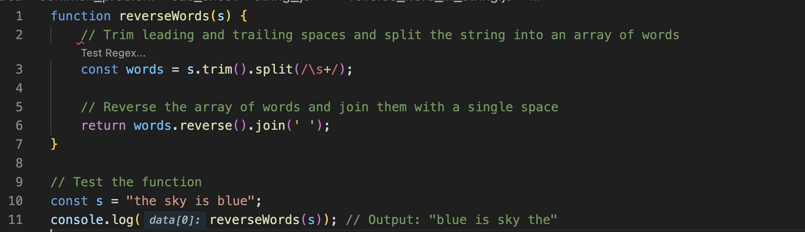

**Step-by-step Explanation:**

1. Trim leading and trailing spaces from the input string `s` using the `trim()` method.
2. Split the trimmed string into an array of words using a regular expression `/\\s+/` to match one or more whitespace characters (spaces).
3. Reverse the array of words using the `reverse()` method.
4. Join the reversed array of words into a single string with a single space between each word using the `join(' ')` method.
5. Return the reversed string.

**Space Complexity:**

* We create an array of words, which requires extra space proportional to the number of words in the input string. Therefore, the space complexity is O(n), where n is the number of words in the input string.

**Time Complexity:**

* The algorithm splits the input string into an array of words in O(n) time, where n is the length of the input string.
* Reversing the array of words takes O(n) time.
* Joining the reversed array of words into a string takes O(n) time.
* Overall, the time complexity is O(n).

### Q 3. Integer to Roman

Roman numerals are represented by seven different symbols: I, V, X, L, C, D and M.

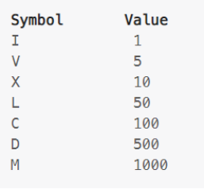

For example, 2 is written as II in Roman numeral, just two one's added together. 12 is written as XII, which is simply X + II. The number 27 is written as XXVII, which is XX + V + II. Roman numerals are usually written largest to smallest from left to right.
However, the numeral for four is not IIII. Instead, the number four is written as IV. Because the one is before the fve we subtract it making four. The same principle applies to the number nine, which is written as IX. There are six instances where subtraction is used:
• I can be placed before V (5) and X (10) to make 4 and 9.
• X can be placed before L (50) and C (100) to make 40 and 90.
• C can be placed before D (500) and M (1000) to make 400 and 900.
• Given an integer, convert it to a roman numeral.
Example 1:
Input: num = 3
Output: "| | |"

=> Let's break down the solution step by step:

1. **Define Roman Numeral Symbols and Values** : We first define two arrays to store the Roman numeral symbols (`symbols`) and their corresponding values (`values`). These arrays are ordered from largest to smallest value.
2. **Iterate Through Symbols** : We iterate through the `symbols` array in descending order of value. This allows us to start with the largest possible Roman numeral symbols.
3. **Append Symbols** : For each symbol in the `symbols` array, we check if the input number is greater than or equal to the corresponding value. If it is, we append the symbol to the result string and subtract the value from the input number.
4. **Repeat Until Number is Zero** : We repeat this process for each symbol in the array until the input number becomes zero. This ensures that we find the Roman numeral representation for the entire input number.

Here's the JavaScript code with step-by-step comments and complexity analysis:

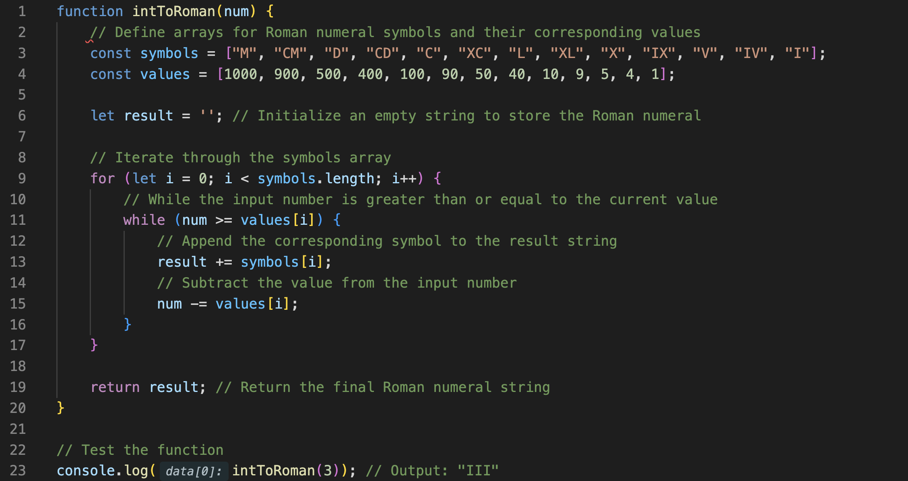

**Time Complexity:** The time complexity of this algorithm is O(1) because the number of iterations in the loop is constant, determined by the number of Roman numeral symbols.

**Space Complexity:** The space complexity is also O(1) because the space used by the `symbols` and `values` arrays is constant and does not depend on the input size. Additionally, the space used by the `result` string is proportional to the length of the Roman numeral representation, which is also constant for any input number.

### Q 4. Simplify Path

Given a string path, which is an absolute path (starting with a slash '/') to a fle or directory in a Unix-style fle system, convert it to the simplifed canonical path. In a Unix-style fle system, a period '.' refers to the current directory, a double period '..' refers to the directory up a level, and any multiple consecutive slashes (i.e. '//') are treated as a single slash '/'. For this problem, any other format of periods such as '...' are treated as fle/directory names.
• The canonical path should have the following format:
• The path starts with a single slash '/'.
• Any two directories are separated by a single slash '/'.
• The path does not end with a trailing '/'.
• The path only contains the directories on the path from the root
directory to the target fle or directory (i.e., no period '.' or double period
'..')
Return the simplifed canonical path. 

**Example 1:**
Input: path = "/home/"
Output: "/home"

=> To simplify a canonical path, we can use a stack data structure to keep track of the valid directories while traversing the input path. We'll split the path by slashes ("/") and process each component accordingly.

**Here's the step-by-step approach:**

1. Split the input path by slashes to get individual components.
2. Initialize an empty stack to keep track of valid directories.
3. Iterate through each component of the path:
   * If the component is ".." and the stack is not empty, pop the top directory from the stack (to go up one level).
   * If the component is not empty, not equal to ".", and not equal to "..", push it onto the stack.
4. Join the directories in the stack with slashes to form the simplified canonical path.
5. Return the simplified canonical path.

Let's implement this in JavaScript:

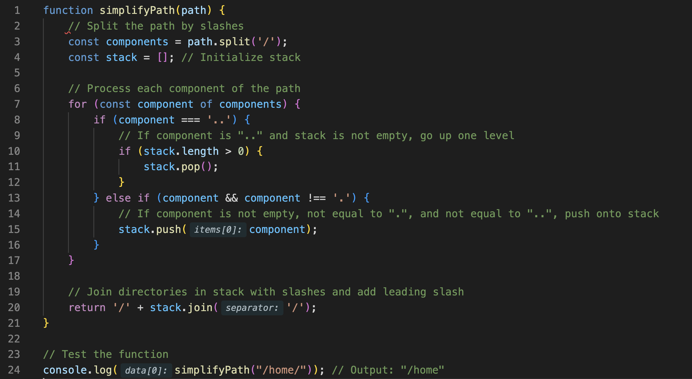

**Time Complexity:** The time complexity of this algorithm is O(n), where n is the length of the input path.

**Space Complexity:** The space complexity is O(n), where n is the length of the input path. This is due to the stack used to store valid directories.

### Q 5. Longest Palindromic Substring

Given a string s, return the longest palindromic substring in s.

**Example 1:**
Input: s = "babad"
Output: "bab"

**=>** To find the longest palindromic substring in a given string, we can use **dynamic programming**. We'll iterate through the string and check if substrings are palindromes. We'll keep track of the longest palindrome found so far.

Here's the step-by-step approach:

1. Initialize variables to keep track of the start and end indices of the longest palindrome found.
2. Iterate through each character in the string:
   * Expand around the current character to check if there's a palindrome centered at it.
   * Check for two cases: one for palindromes with odd length and one for palindromes with even length.
   * Update the start and end indices if a longer palindrome is found.
3. Return the substring using the start and end indices.

Let's implement this in JavaScript:

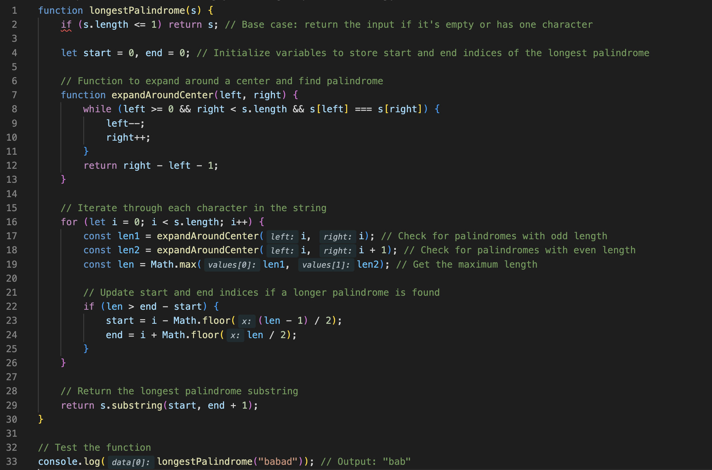

**Time Complexity:** The time complexity of this algorithm is O(n^2), where n is the length of the input string. This is because we iterate through the string and expand around each character to check for palindromes.

**Space Complexity:** The space complexity is O(1) because we only use a constant amount of extra space for storing indices and lengths.

#### Dynamic programming

**=>** Dynamic programming is a method for solving complex problems by breaking them down into simpler subproblems and solving each subproblem only once. It is particularly useful for optimization problems, where the goal is to find the best solution from all possible solutions.

Here's an example of dynamic programming in JavaScript for solving the Fibonacci sequence efficiently:

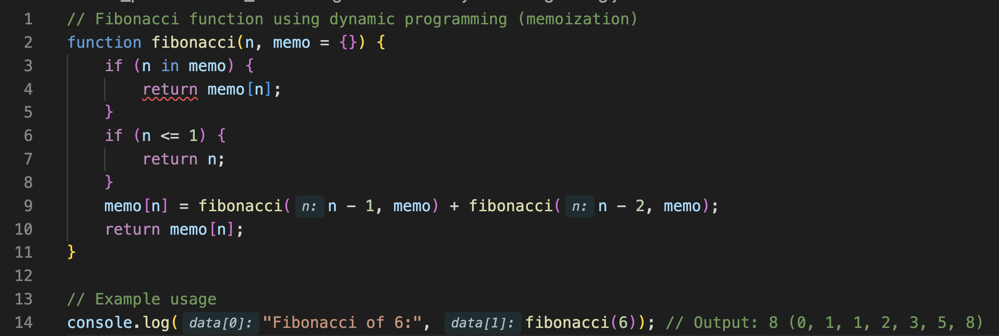

In this example:

* The `fibonacci` function takes an integer `n` as input and computes the `n`-th Fibonacci number.
* It uses an object `memo` to store previously computed Fibonacci numbers to avoid redundant calculations.
* If the Fibonacci number for a particular `n` is already computed and stored in the `memo`, it directly returns the value from the `memo`.
* If `n` is 0 or 1, it returns `n` (base cases of the Fibonacci sequence).
* Otherwise, it recursively computes Fibonacci numbers for `n - 1` and `n - 2` and stores the result in the `memo`.
* Finally, it returns the computed Fibonacci number for `n`.

By using memoization, dynamic programming significantly reduces the number of redundant calculations and improves the efficiency of the Fibonacci sequence computation from exponential time complexity to linear time complexity.

Dynamic programming can be applied to various problems, not just the Fibonacci sequence. It's commonly used in problems involving optimization, such as shortest path problems, knapsack problems, and many others.

#### is recursion same as dynamic programming in js ?

**=>** Recursion and dynamic programming are related concepts, but they are not the same.

Recursion is a programming technique where a function calls itself in order to solve a problem. Recursion can be used to implement various algorithms and solve a wide range of problems. It's a fundamental concept in computer science and is used in many programming languages, including JavaScript.

Dynamic programming, on the other hand, is a method for solving complex problems by breaking them down into simpler subproblems and solving each subproblem only once. Dynamic programming typically involves storing the solutions to subproblems in some form of data structure (such as an array or object) to avoid redundant calculations. Dynamic programming is often used to optimize recursive algorithms by avoiding redundant calculations through memoization or tabulation.

While recursion and dynamic programming are related, they are not interchangeable:

1. **Recursion** : In recursive algorithms, a problem is solved by dividing it into smaller subproblems, each of which is solved recursively. Recursion is a general programming technique and can be used in a variety of contexts, not necessarily involving dynamic programming.
2. **Dynamic Programming** : Dynamic programming is a specific method for solving problems by breaking them down into simpler subproblems and storing the solutions to subproblems to avoid redundant calculations. While recursion is often used in dynamic programming solutions to express the decomposition of the problem, not all recursive algorithms involve dynamic programming.

In summary, recursion and dynamic programming are distinct concepts, but they are often used together, especially in the context of optimizing recursive algorithms using dynamic programming techniques like memoization or tabulation.

### Q 6. Isomorphic Strings

Given two strings s and t, determine if they are isomorphic. 

Two strings s and t are isomorphic if the characters in s can be replaced to get t.
All occurrences of a character must be replaced with another character while preserving the order of characters. No two characters may map to the same character, but a character may map to itself. 

**Example 1:**
Input: s = "egg", t = "add"
Output: true

**=>** To determine if two strings are isomorphic, we need to check if we can replace characters in the first string (`s`) with characters in the second string (`t`) such that the order of characters is preserved and no two characters map to the same character.

Here's a step-by-step approach to solve this problem:

1. Create two maps or arrays to store the mappings from characters in string `s` to characters in string `t`, and vice versa.
2. Iterate through each character in both strings simultaneously.
3. Check if the current characters from both strings are already mapped to each other. If not, create a mapping.
4. If the mapping already exists, ensure that it's consistent. If not, return false.
5. If we reach the end of the strings without any inconsistencies, return true.

Let's implement this in JavaScript:

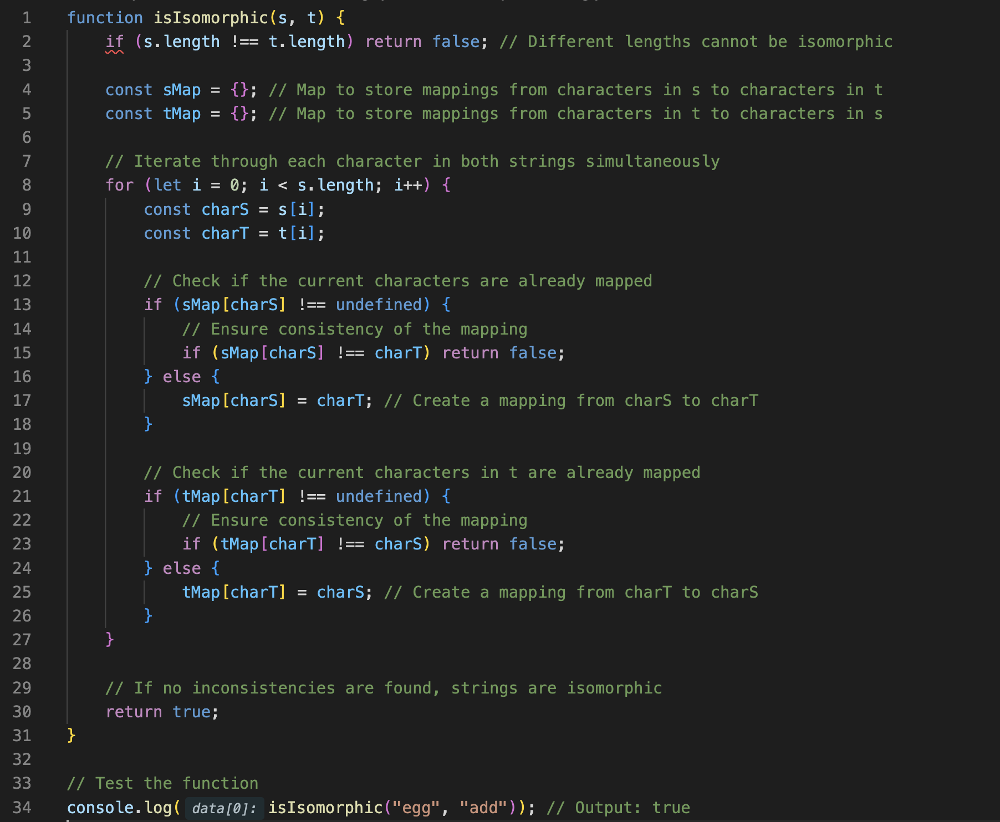

**Time Complexity:** The time complexity of this algorithm is O(n), where n is the length of the input strings `s` and `t`. We iterate through both strings simultaneously once.

**Space Complexity:** The space complexity is also O(n) because in the worst case, we may need to store mappings for each character in both strings.

### Q 7. Longest Common Prefix

Write a function to fnd the longest common prefx string amongst an array of strings.
If there is no common prefx, return an empty string "".

**Example 1:**
Input: strs = ["flower","flow","flight"]
Output: "fl"

=> To find the longest common prefix string amongst an array of strings, we can iterate through the characters of the first string and compare them with the corresponding characters of the other strings. The common prefix will be the longest sequence of characters that are the same across all strings.

Here's how we can implement this in JavaScript:

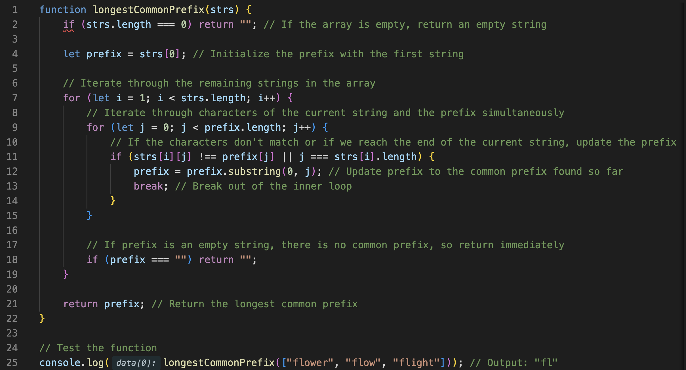

**Time Complexity:** Let `m` be the length of the longest string and `n` be the number of strings. The worst-case time complexity of this algorithm is O(m * n), where we iterate through all characters of the longest string and compare them with characters in other strings.

**Space Complexity:** The space complexity is O(1) because we only use a constant amount of extra space for variables, regardless of the input size

### Q 8. Valid Palindrome II

Given a string s, return true if the s can be palindrome after deleting at most one character from it.

**Example 1:**
Input: s = "aba"
Output: true

**=>** To solve this problem, we can use a **two-pointer** approach. We'll iterate through the string from both ends, comparing characters. If we find a mismatch, we'll check two cases:

1. We'll try skipping the left character and check if the remaining substring is a palindrome.
2. We'll try skipping the right character and check if the remaining substring is a palindrome.

If at least one of these cases results in a palindrome, we return true. Otherwise, we return false.

Here's the implementation in JavaScript:

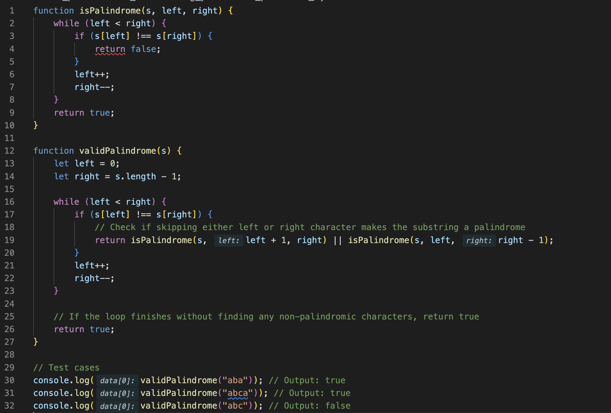

This solution has a time complexity of O(n) and a space complexity of O(1), where n is the length of the input string `s`.

#### The two-pointer approach

The two-pointer approach is a technique used to solve problems involving arrays or linked lists by using two pointers that iterate through the data structure in a way that helps efficiently find a solution.

Here's a basic example of using the two-pointer approach in JavaScript to find a pair of elements in a sorted array that sum up to a target value:

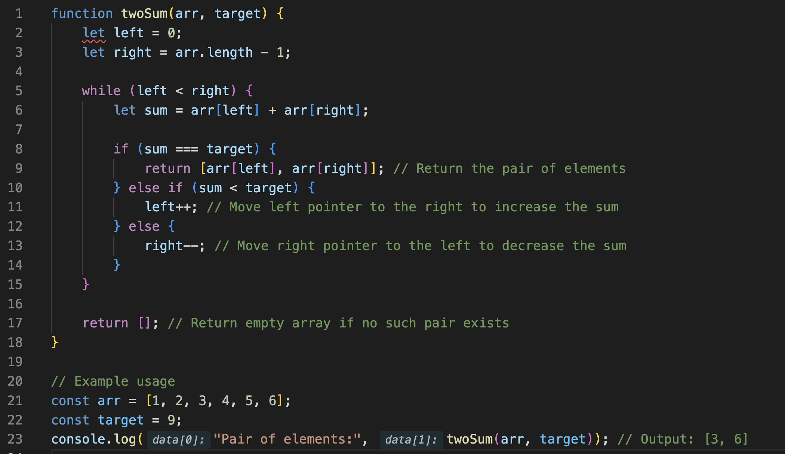

In this example:

* We have a sorted array `arr` and a target value `target`.
* We initialize two pointers, `left` pointing to the start of the array and `right` pointing to the end of the array.
* We iterate through the array using the two pointers.
* At each iteration, we calculate the sum of the elements pointed to by the two pointers.
* If the sum equals the target value, we return the pair of elements.
* If the sum is less than the target value, we increment the `left` pointer to increase the sum by selecting a larger element.
* If the sum is greater than the target value, we decrement the `right` pointer to decrease the sum by selecting a smaller element.
* We continue this process until the pointers meet or until we find a pair that sums up to the target value.

The two-pointer approach is efficient and typically runs in linear time, making it useful for solving various problems involving arrays or linked lists. It's particularly effective for problems that involve searching, comparing, or manipulating elements in a sorted array or linked list.

### Q 9. Find the Index of the First Occurrence in a String

Given two strings needle and haystack, return the index of the frst occurrence of needle in haystack, or -1 if needle is not part of haystack.

**Example 1:**
Input: haystack = "sadbutsad", needle = "sad"
Output: 0

**=>** Sure, here's the JavaScript solution for finding the index of the first occurrence of a substring in another string (`haystack`):

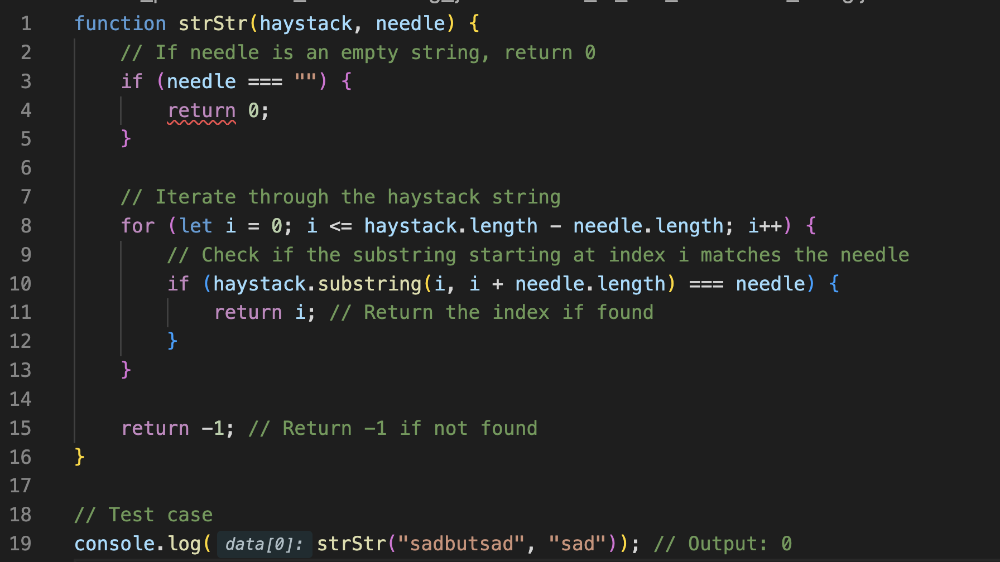

**Step-by-step explanation:**

1. Define a function `strStr` that takes two parameters: `haystack` (the string to search in) and `needle` (the substring to search for).
2. If `needle` is an empty string, return 0 because an empty string is always found at the beginning of any string.
3. Iterate through the `haystack` string using a `for` loop, starting from index 0 up to `haystack.length - needle.length`. This ensures that there are enough characters left in `haystack` for a potential match with `needle`.
4. Inside the loop, extract a substring from `haystack` starting at the current index `i` and having the same length as `needle`. Check if this substring is equal to `needle`.
5. If the substring matches `needle`, return the current index `i`, indicating the position where `needle` is found in `haystack`.
6. If no match is found after iterating through the entire `haystack`, return -1 to indicate that `needle` is not found.

**Space complexity:**

The space complexity of this solution is O(1) because we're not using any additional data structures that grow with the input size. We only use a few variables for indices and strings, which occupy constant space.

**Time complexity:**

The time complexity of this solution is O((n - m) * m), where n is the length of `haystack` and m is the length of `needle`. In the worst case, we iterate through the entire `haystack` string, and for each character position, we compare a substring of length `m` with `needle`. Therefore, the overall time complexity is O((n - m) * m). However, in practice, this algorithm often performs better than the worst-case scenario, especially if `needle` occurs early in `haystack`.

### Q 10. Basic Calculator II

Given a string s which represents an expression, evaluate this expression and return its value.
The integer division should truncate toward zero. You may assume that the given expression is always valid. All intermediate results will be in the range of [-231, 231 - 1].
Note: You are not allowed to use any built-in function which evaluates strings as mathematical expressions, such as eval().

**Example 1:**
Input: s = "3+2*2"
Output: 7

**=>** To evaluate a mathematical expression represented as a string, we can use the approach of converting the infix expression to a postfix expression and then evaluating the postfix expression.

Here's the step-by-step explanation of the solution in JavaScript:

1. Create a helper function `precedence` to determine the precedence of operators. We'll give higher precedence to `*` and `/` compared to `+` and `-`.
2. Create a helper function `applyOperator` to perform arithmetic operations based on the operator.
3. Iterate through the characters of the input string `s`.
4. If the current character is a digit, construct the operand by parsing the number.
5. If the current character is an operator (`+`, `-`, `*`, `/`), compare its precedence with the precedence of the operators in the stack. If the precedence is higher, push it onto the stack.
6. If the current character is a closing parenthesis `)`, pop operators from the stack and apply them until an opening parenthesis `(` is encountered. Then push the result back onto the stack.
7. After iterating through all characters, apply any remaining operators in the stack to get the final result.
8. Return the result.

Here's the JavaScript code implementing the solution:

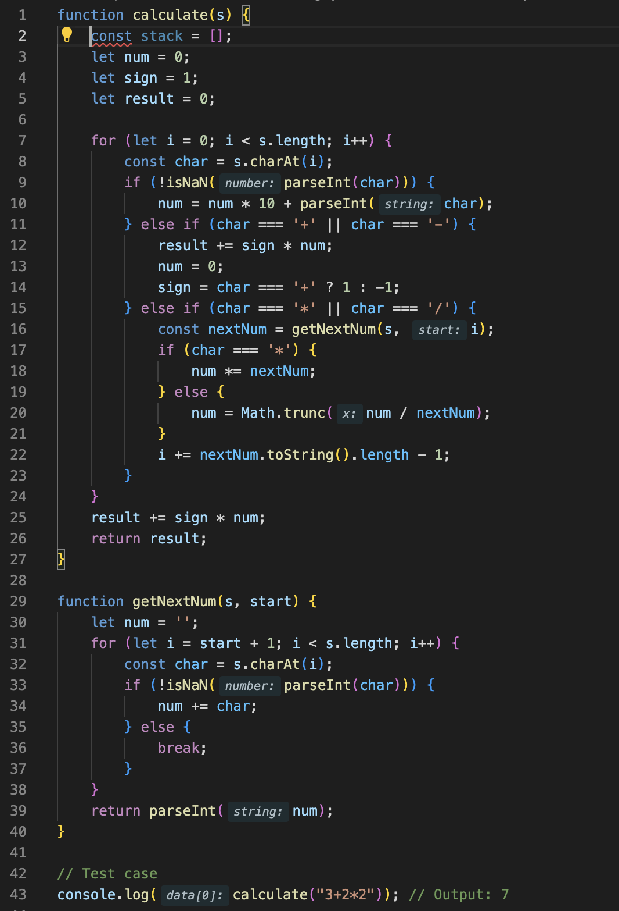

**Time Complexity:**
The time complexity of this solution is O(n), where n is the length of the input string `s`. We traverse the string only once.

**Space Complexity:**
The space complexity is O(1) because we use a constant amount of extra space for variables and the stack.

## Q 11. Largest Odd Number in String

You are given a string num, representing a large integer. Return the largestvalued odd integer (as a string) that is a non-empty substring of num, or an empty string "" if no odd integer exists.
A substring is a contiguous sequence of characters within a string.

**Example 1:**
Input: num = "52"
Output: "5"

**=>** To solve this problem, we can iterate through the string `num` from left to right. For each character, we check if it is an odd digit. If it is, we extend the substring as long as the next digit is also odd. We keep track of the maximum odd substring found so far and update it whenever we find a longer odd substring.

Here's the JavaScript code to implement this approach:

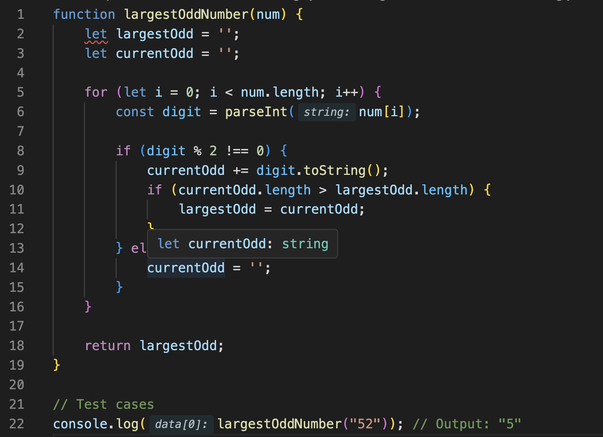

**Explanation:**

* We initialize two variables `largestOdd` and `currentOdd` to store the largest odd substring found so far and the current odd substring being processed, respectively.
* We iterate through the characters of the string `num`.
* For each character, if it is an odd digit (i.e., not divisible by 2), we append it to the `currentOdd` substring and check if the length of `currentOdd` is greater than the length of `largestOdd`. If it is, we update `largestOdd` to be equal to `currentOdd`.
* If the current character is an even digit, we reset `currentOdd` to an empty string since the current substring cannot be extended further.
* Finally, we return the `largestOdd` substring found.

**Time Complexity:**
The time complexity of this solution is O(n), where n is the length of the input string `num`. We traverse the string once.

**Space Complexity:**
The space complexity is O(1) since we use only a constant amount of extra space for storing variables.

### Q 12. Count and Say

The count-and-say sequence is a sequence of digit strings defned by the recursive formula:
countAndSay(1) = "1"
• countAndSay(n) is the way you would "say" the digit string from
• countAndSay(n-1), which is then converted into a different digit string.
To determine how you "say" a digit string, split it into the minimal number of substrings such that each substring contains exactly one unique digit. Then for each substring, say the number of digits, then say the digit. Finally, concatenate every said digit.
For example, the saying and conversion for digit string "3322251":

**Example 1:**
Given a positive integer n, return the nth term of the count-and-say sequence.
Input: n = 1
Output: "1"

**=>** To generate the nth term of the count-and-say sequence, we can use a **recursive approach** where we generate each term based on the previous one. Here's the JavaScript code to implement this approach:

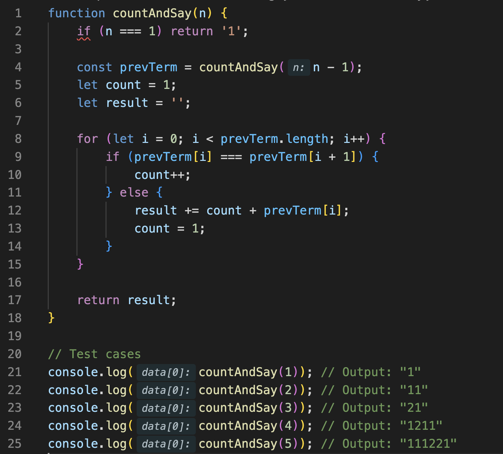

**Explanation:**

* We define the `countAndSay` function that takes a positive integer `n` as input and returns the nth term of the count-and-say sequence.
* The base case is when `n` is 1, in which case we return '1'.
* For `n` greater than 1, we recursively call `countAndSay(n - 1)` to get the (n - 1)th term.
* We then iterate through the characters of the previous term and count consecutive occurrences of the same digit.
* As soon as we encounter a different digit or reach the end of the previous term, we append the count followed by the digit to the result string.
* Finally, we return the result string.

**Time Complexity:**
The time complexity of this solution is O(2^n), where n is the input integer `n`. This is because each term is generated based on the previous term, resulting in exponential growth.

**Space Complexity:**
The space complexity is also O(2^n) due to the recursive calls, as well as the space used for storing the result string for each term.

### Q 13. Minimum Window Substring

Given two strings s and t of lengths m and n respectively, return the minimum window substring of s such that every character in t (including duplicates) is included in the window. If there is no such substring, return the empty string "".
The testcases will be generated such that the answer is unique.

**Example 1:**
Input: s = "ADOBECODEBANC", t = "ABC"
Output: "BANC"

**=>** To solve this problem, we can use the **sliding window** technique along with a **hashmap** to keep track of the characters and their frequencies in the target string `t`. We'll maintain two pointers, `left` and `right`, to define the window.

Here's the JavaScript code to implement this approach:

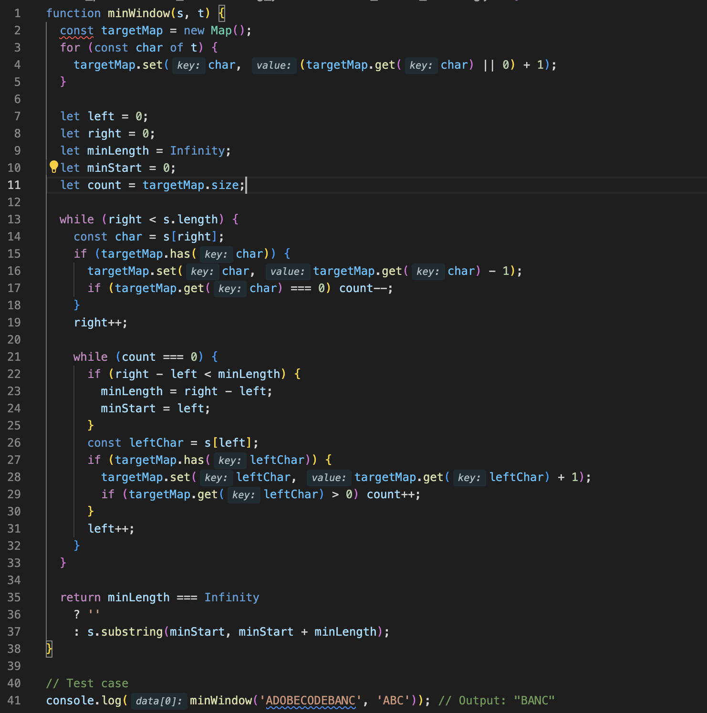

**Explanation:**

* We first create a hashmap `targetMap` to store the characters of the target string `t` along with their frequencies.
* We initialize two pointers, `left` and `right`, and set `minLength` to `Infinity`.
* We iterate through the string `s` using the `right` pointer.
* For each character encountered, we update its frequency in `targetMap` and decrement the `count` if the character is part of `t`.
* When `count` becomes 0, it means we have found a valid window containing all characters of `t`. We then update `minLength` and `minStart` accordingly.
* We then move the `left` pointer to shrink the window until it's no longer valid.
* Finally, we return the substring starting from `minStart` with length `minLength`, or an empty string if no such window exists.

**Time Complexity:**
The time complexity of this solution is O(m + n), where m is the length of string `s` and n is the length of string `t`.

**Space Complexity:**
The space complexity is O(m + n), where m is the number of characters in `t` and n is the number of unique characters in `s`. This is because we store the characters and their frequencies in the hashmap.

### Q 14. Valid Anagram

Given two strings s and t, return true if t is an anagram of s, and false otherwise. An Anagram is a word or phrase formed by rearranging the letters of a different word or phrase, typically using all the original letters exactly once.

**Example 1:**
Input: s = "anagram", t = "nagaram"
Output: true

**=>** To solve this problem, we can use a **hashmap** to count the frequency of characters in both strings `s` and `t`. If both strings have the same frequency of characters, then `t` is an anagram of `s`.

Here's the JavaScript code to implement this approach:

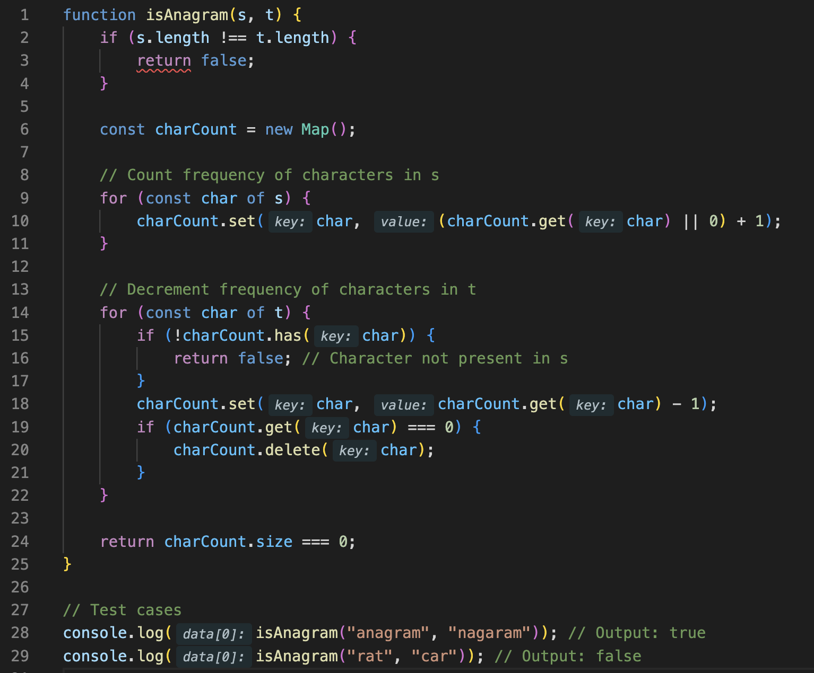

**Explanation:**

* We first check if the lengths of both strings `s` and `t` are equal. If not, they cannot be anagrams, so we return `false`.
* We then create a hashmap `charCount` to count the frequency of characters in string `s`.
* Next, we iterate through string `t` and decrement the count of each character in `charCount`. If the character is not present in `charCount`, or if its count becomes zero, we delete it from the map.
* After processing both strings, if `charCount` is empty, it means all characters in `s` have been matched with characters in `t`, and their counts are the same. Hence, `t` is an anagram of `s`, and we return `true`.
* If `charCount` is not empty at the end, it means there are some characters in `s` that don't occur in `t`, or vice versa, so we return `false`.

**Time Complexity:**
The time complexity of this solution is O(n), where n is the length of the input strings `s` and `t`.

**Space Complexity:**
The space complexity is O(n), where n is the number of unique characters in `s`. This is because we store the counts of characters in the hashmap.
